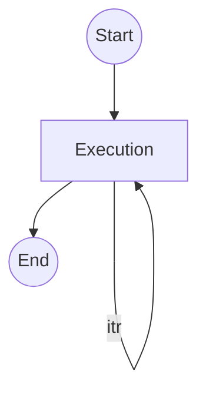

# Terraform Scripts

Terraform scripts can be used to provision any Cloud SUT instances. Usually, Cloud provisioning needs are common among many workloads
thus the terraform scripts are shared under [`script/terraform/template/terraform`][terraform template]. However, 
if a workload provides custom terraform scripts under `workload/<workload>/template/terraform/<CSP>/main`, where `<workload>` is the 
workload name and `<CSP>` is the Cloud provider abbreviation, the specified terraform scripts will be used instead to provision the 
SUT instances. 

## Custom Terraform scripts

> Custom terraform scripts should be used for unique provisioning requirements only. It is not recommended to utilize custom 
> terraform scripts for trivial needs, which as a result duplicates common code.  

If provided, the custom terraform scripts of a workload must be implemented as follows:
- The scripts must implement the same set of input variables such that they can be used (as a module) by 
[`script/terraform/terraform-config.<CSP>.tf`][terraform config csp]. For example, the scripts must take `region`
`zone`, and `owner` as input variables.    
- The scripts must implement the same set or a superset of output variables as required by 
[`script/terraform/terraform-config.<CSP>.tf`][terraform config csp]. For example, the scripts must export the 
SUT instance public and private IPs. 
- The scripts must properly tag the Cloud resources with `owner: <name>` so that the CSP cleanup script can cleanup the corresponding 
Cloud resources. 

See [HammerDB TPCC PAAS][HammerDB TPCC PAAS] for an example of customizing terraform scripts.   

## Ansible Scripts

Ansible scripts can be used to customize the workload host setup, workload execution, and cleanup. 


Please observe the following requirements when writing your custom Ansible scripts:
- If specified, the installation playbook should be at `template/ansible/custom/installation.yaml`, relative to the workload directory. Additional 
roles can be present underneath the `custom/roles` directory. The installation playbook must install all benchmark software onto the SUTs. 
- If specified, the cleanup Ansible playbook should be at `template/ansible/custom/cleanup.yaml`, relative to the workload directory. The cleanup 
script should remove any installed software and restore the system environment.   
- If specified, the workload execution laybook should be at `template/ansible/custom/deployment.yaml`, relative to the workload directory. Additional
roles can be present underneath the `custom/roles` directory. The deployment playbook typically implements the following features:



The start stage prepares the workload execution. For example, create and copy the execution scripts to the SUT. Note that any software installation should be done in `installation.yaml`, not in `deployment.yaml`. The execution stage runs the workload multple times (as specified by the iteration number `wl_run_iterations`.) 

Within each iteration, perform the following steps:  
  - Invoke the [timing](#common-ansible-scripts) role to record the workload start timing.   
  - Run the workload. Save the workload status and logs under `{{ wl_logs_dir }}/itr-{{ itr }}/<pod>`, where `<pod>` is an arbitrary directory that identifies the benchmark pod.  
  - During the workload execution, invoke the [trace](#common-ansible-scripts) role such that telemetry can be collected during the workload execution.   
  - Invoke the [timing](#common-ansible-scripts) role to record the workload stop timing.   

```
# deployment.yaml
- hosts: "{{ ('controller' in groups) | ternary('controller','localhost') }}"
  gather_facts: no
  become: false
  tasks:

    - name: run workloads over iterations
      include_role:
        name: deployment
      when: (ansible_connection|default('ssh')) in ['ssh','local']
      loop: "{{ range(1, run_stage_iterations | default(1) |int+1, 1) | list }}"
      loop_control:
        loop_var: itr

# roles/deployment/tasks/main.yaml
- include_role:
    name: timing
    tasks_from: start-iteration

- name: run the workload
...

- name: invoke traces
  include_role:
    name: trace
  vars:
    trace_waitproc_pid: "{{ workload_process_pid }}"
    trace_logs_scripts: "..."

- include_role:
    name: timing
    tasks_from: stop-iteration

- name: collect trace data
  include_role:
    name: trace
    tasks_from: collect
  when: wl_trace_modules | default('') | split(',') | reject('==','') | length > 0
  ignore_errors: yes
  run_once: true

- name: "collect workload logs under {{ wl_logs_dir }}/itr-{{ itr }}/benchmark"
  file:
    path: "{{ wl_logs_dir }}/itr-{{ itr }}/benchmark"
    state: directory
  delegate_to: localhost
  run_once: true
...
```

The Ansible playbooks can use the following workload parameters:

| Name | Description |
|:-----|:------------|
|**`wl_name`** | The workload name. |
|**`wl_namespace`**| A unique identifier to identify this workload execution. |
|**`wl_run_iterations`**| Specify how many times a workload must execute in sequence. |
|**`workload_config`**| The content of the workload-config yaml file. |

## List Ingredients

Any significant ingredients used in the workload must be declared with a matched pair of variable definitions in `defaults/main.yaml` or `defaults/main/*.yaml`. so that we can easily list ingredients of a workload, for example:

```defaults/main.yaml
IPP_CRYPTO_VER: "ippcp_2020u3"
IPP_CRYPTO_REPO: "https://github.com/intel/ipp-crypto.git"
...
```

The following suffixes are supported:
- **`_REPO`** or **`_REPOSITORY`**: Specify the ingredient source repository location.
- **`_VER`** or **`_VERSION`**: Specify the ingredient version.
- **`_IMG`** or **`_IMAGE`**: Specify an ingredient docker image.
- **`_PKG`** or **`_PACKAGE`**: Specify an ingredient OS package, such as deb or rpm.

> `_VER` and the corresponding `_REPO`/`_PACKAGE`/`_IMAGE` must be in a pair to properly show up in the Wiki ingredient table. For example, if you define `OS_VER`, then there should be an `OS_IMAGE` definition.
> Avoid complicated jinja templates in the variable definitions. For parsing ingredient purpose, the only supported jinja pattern is `{{ variable }}`.   

## Ansible Script Examples

See [SpecSERT][SpecSERT] for an example of customzing Ansible scripts.  

## Ansible Resources

### Ansible Inventory
The following ansible inventory groups can be used in the scripts:

| Name | Description |
|:-----|:------------|
| **`workload_hosts`** | This group contains the VM hosts that are used to run the workloads. If Kubernetes is used, the group refers to VM workers that are within the Kubernetes cluster. |
| **`cluster_hosts`** | If Kubernetes is used, this group refers to all VM workers and the Kubernetes controller. |
| **`off_cluster_hosts`** | This group refers to VM hosts that are outside the Kubernetes cluster. |
| **`trace_hosts`** | This group includes all VM hosts that must collect performance traces. |
| **`controller`** | This is the Kubernetes controller group. |
| **`worker`**, **`client`**, etc | These are the workload VM groups. |
| **`vsphere_hosts`**, **`kvm_hosts`**, etc | These groups contain the physical hosts where the workload VMs reside. |

> Avoid using `hosts: all` in your custom ansible scripts, as the hosts may refer to different types of hosts, for example, workload VMs or the physical hosts where the VMs reside. Use `hosts: cluster_hosts:off_cluster_hosts` to refer to all workload VMs.  

The following code paths are available to ansible scripts:

| Directory | Description |
|:----------|:------------|
| `/opt/workspace` | Map to the logs directory of the current workload. |
| `/opt/workload`  | Map to the source directory of the current workload. |
| `/opt/<backend>` | Map to the backend-specific resources. For terraform, this is `/opt/terraform`, which maps to `<project>/script/terraform`. |
| `/opt/project` | Map to the root directory of the WSF code base. |

> Avoid using `/opt/project` to access any backend-specific resources. Use `/opt/<backend>` instead. This makes it possible to selectively use either the resources within the backend container or the current code in the repository.  

### Common Ansible Scripts

The following ansible roles/tasks can be invoked for common functionalities:

- **containerd**: This role installs the containerd engine.
- **docker**: This role installs the docker engine. 
- **`trace`**: The `trace` role starts the trace procedure and waits for the workload to complete.  
  - `trace_waitproc_pid`: The pid of the workload process.  
  - `trace_logs_scripts`: The list of commands to show service logs. The logs will be piped to the trace procedure for determining ROI triggers.  
  - `trace_logs_host`: The host that the `trace_logs_scripts` scripts run on. This is optional.  
  - `trace_status_file`: Specify a status file that contains the workload return status code.  

> Please note that the `trace` role should not be executed on multiple hosts. Use `run_once: true` to restrict the execution to the first host:

```
  - include_role:
      name: trace
    run_once: true

  Once the trace role completes, you can retrieve the trace results by invoking the `collect` task of the `trace` role:

```
   - include_role:
       name: trace
       tasks_from: collect
     run_once: true
```

- **`docker-image`**: The `docker-image` role copies a set of docker images to a remote docker daemon (`to-daemon.yaml`) or a remote registry (`to-registry.yaml`):
  - `wl_docker_images`: The dictionary of docker images. The keys are the image names and the values are boolean, true if the images are from a secured docker registry. If unsure, set to `true`.  
- **`timing`**: The `timing` role records the start/stop timing of various workload stages with the following tasks to be invoked with:
  - **start/stop-setup**: Record the setup timing.  
  - **start/stop-image-transfer**: Record the image transfer timing.  
  - **start/stop-iteration**: Record the workload iteration timing.  
  - **start/stop-roi**: Record the workload trace ROI timing.  

[terraform template]: ../../../script/terraform/template/terraform
[terraform config csp]: ../../../script/terraform/terraform-config.aws.tf
[HammerDB TPCC PAAS]: ../../../workload/HammerDB-TPCC-PAAS
[SpecSERT]: ../../../workload/SpecSERT
