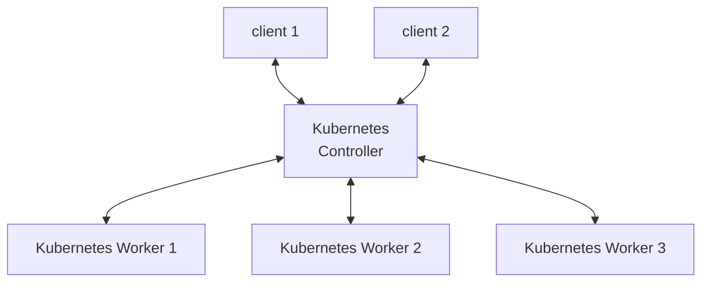

### Introduction

This article describes the technique used to create workloads with North-South traffic, i.e., traffic that enters and leaves a Kubernetes cluster. The 
implementation is based on the terraform backend.  



### Request Off-Cluster Nodes

You can request one or many worker nodes to be off the Kubernetes cluster as follows in `cluster-config.yaml.m4`:  

```
# cluster-config.yaml.m4

cluster:
- labels: {}
- labels: {}
  off_cluster: true
```
where the `off_cluster` option indicates that the requested node is not part of the Kubernetes cluster. 

Optionally, you can define any variables that you might want to pass to the ansible scripts, under `terraform`:         

```
# cluster-config.yaml.m4

terraform:
  off_cluster_docker_image_name: my-docker-image:latest
```

### Install Software on Off-Cluster Nodes

Unlike Kubernetes workers, where the terraform scripts apply the Kubernetes deployment scripts directly, you have to write custom ansibles to install any native software on the off-cluster nodes as follows:

You can overwrite the `template/ansible/kubernetes/installation.yaml` script to install any custom software on the off-cluster nodes:   
```
- import_playbook: installation.yaml.origin

- hosts: worker-1
  become: yes
  gather_facts: no
  tasks:

  - name: Install docker
    include_role:
      name: docker

- hosts: worker-1
  gather_facts: no
  tasks:

  - name: Transfer client image
    include_role:
      name: image-to-daemon
    vars:
      images:
      - key: "{{ off_cluster_docker_image_name }}"
        value: false
      wl_docker_images: "{{ images | items2dict }}"
```
where the above ansible script installs `docker` on the off-cluster node and then transfers the custom docker image to the node. Here 
`wl_docker_images` is a dictionary of docker images, where the keys are the docker images and the values are either `true` or `false`, 
indicating whether the docker images are from a secured or unsecured docker registry. Use `false` if you are not sure.  

### Execute Software on Off-Cluster Nodes

You should manage the native software execution on the off-cluster nodes, by inserting ansible snippets into the regular Kubernetes
execution process, managed by `template/ansible/kubernetes/deployment.yaml` and `template/ansible/kubernetes/roles/deployment/tasks/process-traces-and-logs.yaml`, whereas the former controls the entire process and the later performs trace and log collection during the workload execution. 

Overwrite `template/ansible/kubernetes/deployment.yaml` if you need to do any preparation work, for example, to initialize the Kubernetes deployment script with real cluster IP address, as follows: 

```
- hosts: localhost
  gather_facts: no
  tasks:

  - name: rewrite cluster IP
    replace:
      path: "{{ wl_logs_dir }}/kubernetes-config.yaml.mod.yaml"
      regexp: "127.0.0.1"
      replace: "{{ hostvars['controller-0']['private_ip'] }}"

- import_playbook: deployment.yaml.origin
```
where `127.0.0.1` is a place holder IP address. 

Overwrite the `template/ansible/kubernetes/roles/deployment/tasks/process-traces-and-logs.yaml` script to insert off-cluster software execution. 

Depending on the workload design, if the off-cluster node is used simply as a client simulator and the workload traces and logs are within the
Kubernetes cluster, then you can simply start the off-cluster node and then release the control back to the terraform original code: 

```
# This step should not block as the Kubernetes services may not be up and running yet.   
- name: start off-cluster-node
  command: "docker run --rm -d {{ off_cluster_docker_image_name }}"
  register: container
  delegate_to: worker-1

- name: resume Kubernetes routines
  include_tasks:
    fle: process-traces-and-logs.yaml.origin

- name: destroy container
  command: "docker rm -f {{ container.stdout }}"
  delegate_to: worker-1
```

If the off-cluster node is where the traces and logs must be collected, you can use the [`off-cluster-docker.yaml`](../../../script/terraform/template/ansible/kubernetes/roles/deployment/tasks/off-cluster-docker.yaml) script, which is a common utility that monitors the container until completion, at the same time collecting traces for all the hosts (including the Kubernetes workers.) 

```
- name: start off-cluster-node
  command: "docker run --rm -d {{ off_cluster_docker_image_name }}"
  register: container
  delegate_to: worker-1

- name: monitor the docker execution and process traces and logs
  include_tasks:
    file: off-cluster-docker.yaml
  vars:
    off_cluster_host: worker-1
    off_cluster_container_id: "{{ container.stdout }}"

- name: start off-cluster-node
  command: "docker rm -f {{ container.stdout }}"
  register: container
  delegate_to: worker-1
```

If your off-cluster node execution isn't based on docker, you can model from the `off-cluster-docker.yaml` script to write your 
own traces and logs collection routine.
