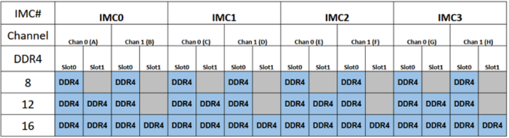

This document is a guide for enabling and setting up Intel SGX (Software Guard Extensions) function on Intel platform which support SGX, and this guide includes the configuration in BIOS and Linux kernel. Before of the setup, please make sure the platform supports SGX.

### HW Prerequisites:
- The CPU SKU need to support SGX feature.
- The memory configuration on board need to match following layout:



### BIOS setup for SGX

**Ice Lake SP Xeon platform**


Ensure the following BIOS settings are set as shown:

- TME enable:

```
Advanced -> Socket Configuration -> Processor Configuration -> TME, MK-TME, TDX -> Total Memory Encryption -> Enable
```

NOTE: SGX will be visible only if TME is enabled.

- Disable UMA-Based Clustering (Otherwise SGX will be grayed out):

```
Advanced -> Socket Configuration -> Common RefCode Configuration -> UMA-Based Clustering -> Disable
```

- Enable SGX:

```
Advanced -> Socket Configuration -> Processor Configuration -> SW Guard Extensions(SGX) -> Enable
```

- Disable Patrol scrub (Only LCC & HCC):

```
Advanced -> Socket Configuration -> Memory RAS Configuration -> Patrol Scrub -> Disable
```

- Disable Mirroring:

```
Advanced -> Socket Configuration -> Memory RAS Configuration -> Mirror Mode -> Disable
```

- Enable Memory ECC

```
Please make sure the Memory ECC function is enabled, generally, ECC is enabled by default for server platform
```

**Desktop platforms**

On desktop/laptop platforms the BIOS setup is simpler, normally only one option for enabling SGX and another for SGX reserved memory size. Setting SGX to enabled should be enough.

```
Note: After SGX is enabled in BIOS, then we can find the SGX instruction is supported via CMD "lscpu | grep -i sgx" on Linux system.
```

### Install Intel SGX driver

Make sure the Linux kernel in your system is >= v5.11. The SGX driver is in mainline kernel since v5.11, so if the target kernel is already 5.11+, no other SGX driver is needed. If `/dev/sgx_enclave` and `/dev/sgx_provision` don't exist, please check the kernel config `CONFIG_X86_SGX` to make sure the SGX driver is enabled.

Gramine requires the kernel has FSGSBASE enabled. Kernel v5.9 or newer has FSGSBASE enabled by default. If you are running a kernel older than v5.9, please update the kernel or apply FSGSBASE patches and recompile.


### Verify SGX and Gramine-SGX

With the SGX BIOS settings, SGX driver, SDK and PSW ready, Gramine SGX can work on the system. Please refer one of below two methods to verify the SGX environment:
1, Run [test sgx environmentscript](script/sgx/test-sgx-environment.bash) on SUT to verify the SGX environment is completely setup.
2, Run [check sgx available](script/sgx/is_sgx_available) on SUT to quick verify the SGX environment status.

### Node Labels

If the system supports SGX function, then enable SGX and setup the configuration following above steps. SGX enabled workloads use [Node Feature Discovery](setup-kubernetes.md#setup-node-feature-discovery) generated labels. In particular an SGX test can be run on a node that has the label `feature.node.kubernetes.io/cpu-sgx.enabled="true"`. 

### Reference:
- [SGX BIOS Setup guide from 01.org](https://download.01.org/intelsgxstack/2021-04-30/Getting_Started.pdf)
- [SGX DCAP driver source code](https://github.com/intel/SGXDataCenterAttestationPrimitives)
- [legacy out-of-tree driver source code](https://github.com/intel/linux-sgx-driver)
- [SGX SDK and PSW](https://github.com/intel/linux-sgx)
- [SGX SDK Binaries build and installation](https://01.org/intel-software-guard-extensions/downloads)
- [SGX SDK Source code build](https://github.com/intel/linux-sgx)
- [SGX SW Installation Guide](https://download.01.org/intel-sgx/sgx-linux/2.14/docs/Intel_SGX_SW_Installation_Guide_for_Linux.pdf)
- [Gramine build guidance](https://gramine.readthedocs.io/en/latest/devel/building.html)
- [Gramine Github Repository](https://github.com/gramineproject/gramine)
