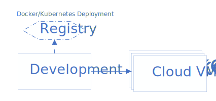
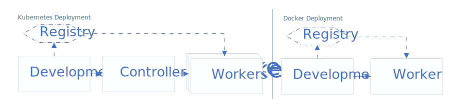
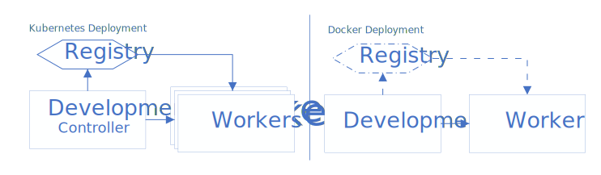
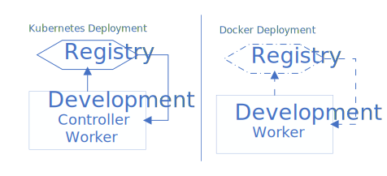

### Introduction

This document describes the steps and scripts to setup host environment for workload evaluation and development on the Cloud or On-Premises.   

### Prerequisite

Ensure that your cluster hosts are properly setup in terms of hostname, networking, proxy and datetime:

- The hostname must be unique within your subnet and follow [RFC-1178](http://www.faqs.org/rfcs/rfc1178.html), i.e., matching pattern `[a-z][a-z0-9-]*`. 
- The hostname is properly registered with DNS so that any of your cluster host can reach each other via hostname.
- If you are behind a corporate firewall, please setup `http_proxy`, `https_proxy` and `no_proxy` in `/etc/environment`.
- Sync your host datetime. An accurate system time is required for any credential authentication operations.

### Cloud Development Setup



To develop or evaluate workloads for Cloud, you need a Linux development machine. The development machine can be used to build workloads and provision Cloud VMs. The workload execution results are saved back to the development machine before publishing to the WSF portal, if specified. A valid docker registry is optional in this setup.     
  
- Run the [`setup-dev.sh`](#setup-devsh) script to setup the development host.  
- Follow the backend specific instructions to initialize Cloud accounts. See [Terraform Cloud Setup](setup-terraform.md#configure-cloud-account).  

> Completely optional in this setup, if you would like to setup a local docker registry for building workloads and storing the built images, run the [`setup-reg.sh`](#setup-regsh) script to setup your private docker registry.  
  
### On-Premises Development Setup

There are many ways to organize a cluster of on-premises hosts for workload execution and development. The WSF supports the following variations:

#### Dedicated Development, Controller and Workers



Mostly used for large scale deployment, the DDCW setup uses dedicated hosts for development, Kubernetes controller, and Kubernetes workers. This is the recommended setup. Note that a controller is not needed to validate workloads via docker.

- Run the [`setup-dev.sh`](#setup-devsh) script to setup the development host:
- Completely optional in this setup, if you plan to setup a local docker registry for building workloads and storing the built images, run the [`setup-reg.sh`](#setup-regsh) script (on the development host) to setup your private docker registry.   
- Run either the [`setup-sut-docker.sh`](#setup-sut-dockersh) script or the [`setup-sut-k8s.sh`](#setup-sut-k8ssh`) script to setup the workers. The docker setup can run most of the single-node workloads. The Kubernetes setup can run all workloads (not tied to any Cloud services) on premises.     

#### Combined Development and Controller with Dedicated Workers



In this setup, the development and Kubernetes controller share the same host. The Kubernetes workers still use dedicated hosts. The fact that the Kubernetes controller shares the same host restricts certain host-level operations such as updating the system with self-signed certificates. A docker registry is a must have to validate workloads via Kubernetes. The registry is optional to validate workloads via docker.
  
- Run the [`setup-dev.sh`](#setup-devsh) script on the development host: 
- Run the [`setup-reg.sh`](#setup-regsh) script to setup a privacy registry on the development host. Optional if you plan to run workloads via docker only. 
- Run either the [`setup-sut-docker.sh`](#setup-sut-dockersh) script or the [`setup-sut-k8s.sh`](#setup-sut-k8ssh`) script to setup the workers. The docker setup can run most of the single-node workloads. The Kubernetes setup can run all workloads (not tied to any Cloud services) on premises.     

#### Single Host Development Environment



This is mostly for quick evaluation and workload development. The WSF scripts will not be able to perform many automations that lead to restart containerd, dockerd, or Kubernetes. A docker registry is a must have to validate workloads via Kubernetes. The registry is optional to validate workloads via docker.
  
- Run the [`setup-dev.sh`](#setup-devsh) script on the development host: 
- Run the [`setup-reg.sh`](#setup-regsh) script to setup a privacy registry on the development host. Optional if you plan to run workloads via docker only.  
- Run either the [`setup-sut-docker.sh`](#setup-sut-dockersh) script or the [`setup-sut-k8s.sh`](#setup-sut-k8ssh`) script to setup the workers. During the setup, specify the same IP address for the controller and the worker. Since there is only 1 worker node, you can only run single-node workloads on either the docker or Kubernetes setup.     

### Setup Scripts

#### setup-dev.sh

The [`setup-dev.sh`](../script/setup/setup-dev.sh) script creates the host enironment for building workloads and evaluting workloads. 
The script does not have any arguments and performs the following options underneath:
- Install Intel certificates.
- Install packages: `cmake`, `make`, `m4`, and `gawk`. These are minimum system requirements.
- Install and setup [`docker`](setup-docker.md) on your host. 
- Add an alias `ctest=./ctest.sh` to your `~/.bashrc`.  

The script requires sudo privilege. After the setup, for any changes to take effect, you must <b>logout of the current ssh section</b> and relogin the development host .   

#### setup-sut-docker.sh
  
The [`setup-sut-docker.sh`](../script/setup/setup-sut-docker.sh) script creates the host environment for docker execution. The script takes the following arguments:

```
Usage: <user@worker1-ip>
```

#### setup-sut-k8s.sh
  
The [`setup-sut-k8s.sh`](../script/setup/setup-sut-k8s.sh) script creates the host environment for Kubernetes. The script takes the following arguments:

```
Usage: <user@controller-ip> <user@worker1-ip> [<user>@worker2-ip> ...]
```

#### setup-reg.sh

The [`setup-reg.sh`](../script/setup/setup-reg.sh) script can help to create a private docker registry or a pass-through registry on the development host. The private docker registry can be used to save rebuilt docker images. A pass-through registry can provide a cached mirror to any official registries.  

```
Usage: [options] <hostname|ip>[:port]
--mirror <url>     Specify the mirror URL
```

The mandated argument is the hostname or IP of the registry URL. The port is optional. The default port for a docker registry is 20666 and the default port for a pass-through registry is 20690. You can create both on the same host if required.   

Examples:

```
# create a docker registry on my host xx.yy.zz
script/setup/setup-reg.sh xx.yy.zz

# create a pass-through registry on my host xx.yy.zz, mirroring docker.io
script/setup/setup-reg.sh xx.yy.zz --mirror docker.io
```

After the setup, you can set the `REGISTRY` value to be the registry URL, in the form of `<hostname|ip>:<port>`.  

```
# setup to use the docker registry
cd build
cmake -DREGISTRY=xx.yy.zz:20666 ..

# setup to use the pass-through registry
cd build
cmake -DREGISTRY=xx.yy.zz:20690 ..
```
