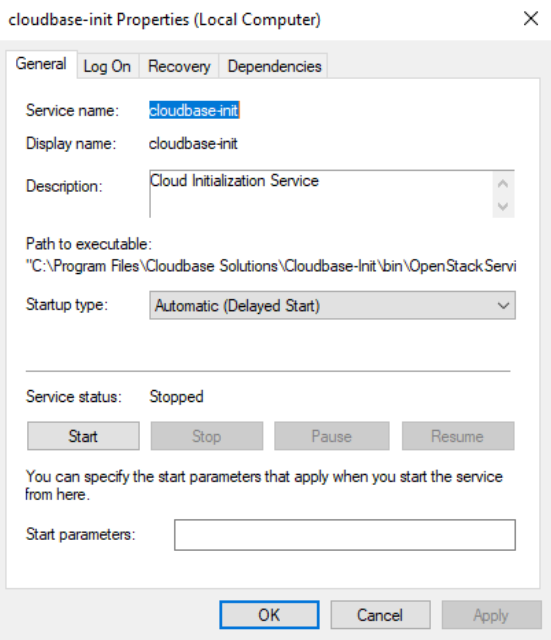

### Introduction

This document describes the Hyper-V host setup and how to create Windows/Linux VM images. The VM images can be used as OS images in the terraform backend and the `hyperv` SUT type.     

### Setup Hyper-V Host

On the Hyper-V host, 
- Turn on the `Virtualization` option in BIOS on the Hyper-V host.  
- If the Hyper-V host is Windows Server 2003, set the `IPEnableRouter` parameter to `1` in the registry key `HKLM\SYSTEM\ControlSet001\Services\Tcpip\Parameters`.  
- Follow the [instructions](https://github.com/taliesins/terraform-provider-hyperv#setting-up-server-for-provider-usage) to enable WinRM (https) on the Hyper-V host. In addition, change the WinRM authentication method to be `basic`:

```
Set-WSManInstance WinRM/Config/Service/Auth -ValueSet @{Basic = $true}
Set-WSManInstance WinRM/Config/Service/Auth -ValueSet @{Negotiate = $false}
Set-Item -Path WSMan:\localhost\Service\MaxConcurrentOperationsPerUser -Value 4294967295
Set-Item -Path WSMan:\localhost\Service\MaxConnections -Value 4294967295
```

- Create a few directories:
  - **`C:\Users\Public\Documents\Hyper-V\osimages`**: Store any pre-downloaded OS images. To save time, you can predownload Windows and Linux OS images into this directory:
    - **`windows-server-2022-gen1.vhdx`**: See [Prepare Windows OS Image](#create-windows-vm-os-images). 
    - **`ubuntu-server-2204.vhdx`**: See [Prepare Linux OS Image](#setup-linux-vm-images).
  - **`C:\Users\Public\Documents\Hyper-V\runs`**: Store any run-time disks and VM instances.  
  - **`C:\Users\Public\Documents\Hyper-V\scripts`**: Store any run-time powershell scripts. 

On the Linux dev machine, 
- Modify `/etc/environment` to add the HyperV host IP address to the `no_proxy` list. Source `/etc/environment` for the current ssh session. 
- Create a configuration file under `script/csp/.hyperv/config.json` with content as follows:

```
{
  "winrm_user": "Administrator",
  "winrm_password": "xyzxyz"
}
```

### Execute Workloads

- Modify `script/terraform/terraform-config.hyperv.tf` to specify the Hyper-V host IP address and winrm port.    
- Configure `TERRAFORM_SUT=hyperv` to use the hyper-v SUT type. 

```
cd build
cmake -DTERRAFORM_SUT=hyperv -DBENCHMARK=<workload> ..
make
./ctest.sh -R _pkm -V
```

### Trouble Shoot

If you need to login to the VM instances, 
- For Linux VM instances, use `./debug.sh` to go into the terraform container, and then use `ssh -i ssh_access.key -p <port> <user>@<ip>` to login to the Linux VM instances, where `<port>`, `<user>`, and `<ip>` are VM instance information available in the `inventory.yaml` file.  
- For Windows VM instances, set a temporary admin password by changing `${password}` in `script/terraform/template/terraform/hyperv/local/template/cloud-init.windows.tpl`. Then you can connect to the Windows VM instances from the Windows HyperV manager. Please restore `cloud-init.windows.tpl` after trouble shooting.  

```
users:
  -
    name: Administrator
    primary_group: Administrators
    passwd: '${password}'
```
- To test WinRM connections, use the following command:

```
winrm identify -r:https://127.0.0.1:5986 -auth:basic -u:<user> -p:<passwd> -encoding:utf-8 -skipCAcheck -skipCNcheck
```

### Advanced Topic: Create Custom OS Images

If for any reason, you need to create custom OS images, use the following sections to create Windows/Linux OS Images.  

#### Create Windows VM OS Images

Use the following steps to create Windows OS images:

- Download the Windows Server 2022 iso image from the [Microsoft* evaluation center](https://www.microsoft.com/en-us/evalcenter/download-windows-server-2022). 
- Launch the Windows VM using the Hyper-V manager with the following configurations:
  - Use Generation-1.
  - Create a disk image `windows-server-2022.vhdx` of about 11MB in size.
  - Create a DVD drive with the content from the Windows Server 2022 iso. 
- During the setup, select `Windows Server 2022 Standard Evaluation (Desktop Experience)`:


- After the OS setup, continue the VM setup:
  - Set execution policy unrestricted with powershell:

```powershell
Set-ExecutionPolicy Unrestricted
```

  - Use `diskpart` to delete any system recovery partition, and use `Computer Management->Disk Management` to expand `disk0` to the full extent. This is critical so that the disk can be expanded later to other sizes.  

```powershell
diskpart
> select disk 0
> select partition 3
> delete partition override
```


  - Download [`cloudbase-init`](https://cloudbase-init.readthedocs.io/en/latest/intro.html#download):

```powershell
Invoke-WebRequest -Uri https://github.com/cloudbase/cloudbase-init/releases/download/1.1.4/CloudbaseInitSetup_1_1_4_x64.msi -OutFile CloudbaseInitSetup_1_1_4_x64.msi -Proxy http://proxy-dmz.intel.com:911
```

  - Install `cloudbase-init`. During the installation, change the username to `Administrator` at this screen, and then click `Install` to install `cloudbase-init`. Pause to modify a few files in the next step, before proceeding to the final screen.


  - Modify `c:\Program Files\Cloudbase Solutions\Cloudbase-init\conf\cloudbase-init-unattended.conf`:

```
metadata_services=cloudbaseinit.metadata.services.nocloudservice.NoCloudConfigDriveService,cloudbaseinit.metadata.services.base.EmptyMetadataService
plugins=cloudbaseinit.plugins.common.sethostname.SetHostNamePlugin,cloudbaseinit.plugins.windows.createuser.CreateUserPlugin,cloudbaseinit.plugins.windows.extendvolumes.ExtendVolumesPlugin,cloudbaseinit.plugins.windows.winrmlistener.ConfigWinRMListenerPlugin,cloudbaseinit.plugins.common.userdata.UserDataPlugin
allow_reboot=true
```

  - Fire up `services` and modify the `cloudbase-init` service properties (`Startup Type` -> `Delayed Start`):



  - Modify `c:\Program Files\Cloudbase Solutions\Cloudbase-init\conf\Unattend.xml` as follows:

```
...
    <RunSynchronousCommand wcm:action="add">
      <Order>1</Order>
      <Path>sc.exe config cloudbase-init start= delayed-auto</Path>
      <Description>Start cloudbase-init</Description>
      <WillReboot>Never</WillReboot>
    </RunSynchronousCommand>
    <RunSynchronousCommand wcm:action="add">
      <Order>2</Order>
      <Path>cmd.exe /c ""C:\Program Files\Cloudbase Solutions\Cloudbase-Init\Python...
      ...
    </RunSynchronousCommand>
...
```

  - Go back to the `cloudbase-init` installation screen. Select both `sysprep` and `shutdown`, and then click `Finish` to complete the installation. Wait until `sysprep` is completed and the VM is shutdown. 


You can now copy your `windows-server-2022.vhdx` (under `c:\Users\Public\Public Documents\Hyper-V\Virtual hard disks`) to an antifactory for reuse with HyperV. **Do not boot again with this VM image as booting the image may invalidate the cloud-init status, in which case you have to repeat the cloud-init steps.**

#### Setup Linux VM Images

Use the following steps to create Linux VM OS images:
- **Linux ISO**: Download the Ubuntu Server 2204 ISO image from [Ubuntu* Cloud Images](https://cloud-images.ubuntu.com). 
- Launch the Linux VM using Hyper-V as follows:
  - Use Generation-1.
  - Create a disk image `ubuntu-server-2204.vhdx` of about 10GB in size.
  - Create a DVD drive with the content from the Ubuntu Server 2204 iso image. 
  - Select the `Ubuntu Server` edition during the installation.    
  - During disk partitioning, de-select `LVM` to not use the LVM-managed disks. Make sure the root partition is the last partition and occupies the rest of the disk space.   
  - Select to install the `openssh` service.  
  - Create a `ubuntu` user and set an initial password. 

- After the OS setup, continue the VM setup:
  - Login to the `ubuntu` user and install the Linux Integration Service.

```
sudo apt-get install -y linux-virtual \
  linux-cloud-tools-virtual \
  linux-tools-virtual
```
   
  - Cleanup `cloud-init` and shutdown the system:

```
# Anything commented out below are optional

# nic must have "old" name, eg. eth0 and not ens18
#cat << EOF > /etc/udev/rules.d/70-persistent-net.rules
#SUBSYSTEM=="net", ACTION=="add", DRIVERS=="?*", ATTR{dev_id}=="0x0", ATTR{type}=="1", NAME="eth0"
#EOF

# this prevents network configuration from happening, says so right in the name
#rm -f /etc/cloud/cloud.cfg.d/subiquity-disable-cloudinit-networking.cfg

# ConfigDrive needs to come first (I think)
#cat << EOF > /etc/cloud/cloud.cfg.d/99-pve.cfg
#datasource_list: [ConfigDrive, NoCloud]
#EOF

# this is super important, netplan files are not regenerated if they exist
#sudo rm -f /etc/netplan/00-installer-config.yaml
#sudo rm -f /etc/netplan/50-cloud-init.yaml

sudo cloud-init clean
sudo shutdown -h now
```

After shutting down, you can copy your `linux-server-2204.vhdx` (under `c:\Users\Public\Documents\Hyper-V\Virtual hard disks`) to an antifactory for reuse with Hyper-V. **Do not boot again with this VM image as booting the image may invalidate the cloud-init status, in which case you have to repeat the cloud-init steps.**
