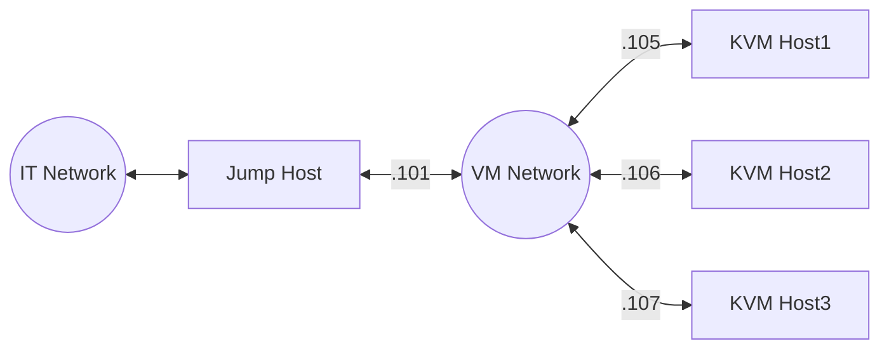
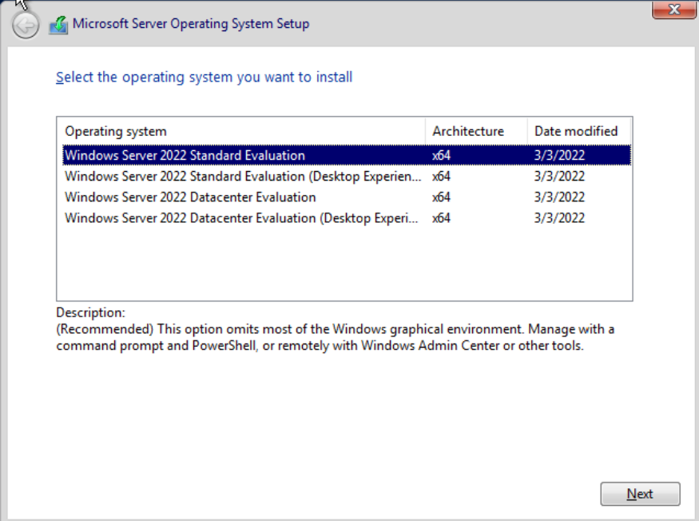
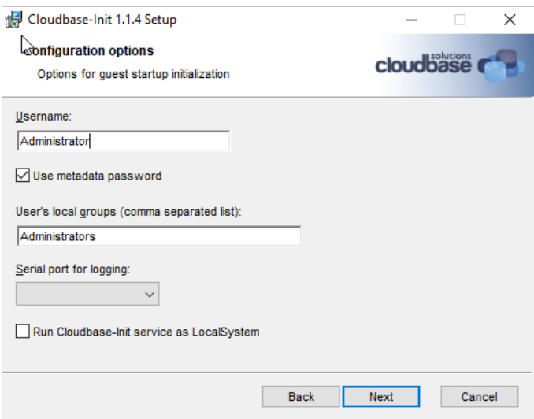
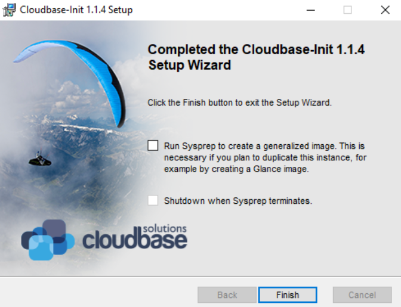

### Introduction

A KVM host can serve as many VMs as the KVM host can afford the capacity (CPU, Memory, and Disk). The VMs connect to each other via virtual network and communicate to the Internet via NAT. When a single KVM host is not powerful enough, we need to setup multiple KVM hosts to share the load. This document describes the setup details.   

### Single KVM Host

The [`setup-sut-kvm.sh`](setup-wsf.md#setup-sut-kvmsh) script can be used to setup any KVM host. It is as simple as running the following command:

```
script/setup/setup-sut-kvm.sh <user>@<kvm-host-ip> --reset
```

Then modify `script/terraform/terraform-config.kvm.tf` to specify the KVM host URL as follows:

```
...
# single KVM host
variable "kvm_hosts" {
  default = [{
    user   = "<user>"
    host   = "<kvm-host-ip>"
    port   = 22
    # DHCP must be enabled on the network interface
    networks = [ "default" ]
    # if specified, os image will reuse the storage pool
    # images (with same image names.)
    pool   = null
  }]
}
```
where the `pool` value can be `null` if you don't have an existing KVM storage pool that caches all OS images. For better efficiency, please cerate a KVM storage pool and cache the following OS images:
- **`jammy-server-cloudimg-amd64.img`**: Download from https://cloud-images.ubuntu.com/jammy/current/jammy-server-cloudimg-amd64.img
- **`windows-server-2022.qcow2`**: See [Prepare Windows VM](#prepare-windows-vm)

### Multiple KVM Hosts via VXLAN

VXLAN creates a virtual network on top of the physical network to enable the communication among multiple KVM hosts. Use the [`setup-sut-kvm.sh`](setup-wsf.md#setup-sut-kvmsh) script to setup each KVM host. 

```
./setup-sut-kvm.sh <user>@<kvm-host1-ip> <user>@<kvm-host2-ip> --vxlan --reset
```

- Modify the `script/terraform/terraform-config.kvm.tf` as follows:

```
...
# multiple KVM hosts
variable "kvm_hosts" {
  default = [{
    user = "<user>"
    host = "<kvm-host1-ip>"
    port = 22
    # DHCP must be enabled on the network interface
    networks = [ "wsfbr0", "default" ]
    # if specified, os image will reuse the storage pool
    # images (with same image names.)
    pool = null
  }, {
    user = "<user>"
    host = "<kvm-host2-ip>"
    port = 22
    # DHCP must be enabled on the network interface
    networks = [ "wsfbr0", "default" ]
    # if specified, os image will reuse the storage pool
    # images (with same image names.)
    pool = null
  }]
}
```
where the `wsfbr0` network interface is used for inter-KVM host communication and the `default` network interface is used to communicate to the Internet.

See Also: [Control Where VMs Are Created](#Control-Where-VMs-Are-Created)

### Multiple KVM Hosts via Bridged Network

You can also use bridged networking among KVM hosts. The VMs created by each KVM host connect via bridged networking. Since most IT infrastructures discourage or prohibit bridged networking. We need to add a `JumpHost` to isolate the VM network from the IT network, as follows:



#### JumpHost Setup

The `JumpHost` is equipped with two network interfaces: a primary network interface connects to the IT network and a secondary network interface connects to the VM network. 

#### Proxy Server

We need to install a `squid` proxy server on the `JumpHost` so that `KVM-Host1-3` can access to the IT network through the socks5 proxy.

```
sudo apt-get install -y squid
```

Assume the VM network is `192.168.121.0/24`, the JumpHost IP address is `192.168.121.101`, the squid configuration is as follows:  

```
# /etc/squid/squid.conf
acl localnet src 192.168.121.0/24       # RFC 1918 local private network (LAN)
acl localnet src fc00::/7               # RFC 4193 local private network range
acl localnet src fe80::/10              # RFC 4291 link-local (directly plugged) machines
acl SSL_ports port 443
acl Safe_ports port 80          # http
acl Safe_ports port 21          # ftp
acl Safe_ports port 443         # https
acl Safe_ports port 70          # gopher
acl Safe_ports port 210         # wais
acl Safe_ports port 1025-65535  # unregistered ports
acl Safe_ports port 280         # http-mgmt
acl Safe_ports port 488         # gss-http
acl Safe_ports port 591         # filemaker
acl Safe_ports port 777         # multiling http
acl intel dstdomain .intel.com
always_direct allow intel
never_direct allow !intel
cache_peer proxy-dmz.intel.com parent 911 0 default
http_access deny !Safe_ports
http_access allow localhost manager
http_access allow localnet
http_access deny manager
include /etc/squid/conf.d/*.conf
http_access allow localhost
http_access deny all
http_port 192.168.121.101:3128
coredump_dir /var/spool/squid
refresh_pattern ^ftp:           1440    20%     10080
refresh_pattern ^gopher:        1440    0%      1440
refresh_pattern -i (/cgi-bin/|\?) 0     0%      0
refresh_pattern \/(Packages|Sources)(|\.bz2|\.gz|\.xz)$ 0 0% 0 refresh-ims
refresh_pattern \/Release(|\.gpg)$ 0 0% 0 refresh-ims
refresh_pattern \/InRelease$ 0 0% 0 refresh-ims
refresh_pattern \/(Translation-.*)(|\.bz2|\.gz|\.xz)$ 0 0% 0 refresh-ims
refresh_pattern .               0       20%     4320
```

#### DHCP Server

Optionally, if there is no DHCP server on the VM network, we can install a DHCP server on the `JumpHost` as well:

```
sudo apt-get install -y isc-dhcp-server
```

The DHCP configuration is as follows:

```
# /etc/dhcp/dhcpd.conf
option domain-name "iotg";
default-lease-time 600;
max-lease-time 7200;
ddns-update-style none;
authoritative;

subnet 192.168.121.0 netmask 255.255.255.0 {
  range 192.168.121.20 192.168.121.100;
  option routers 192.168.121.101;
}
```

#### SSH Tunnels

We need to create a few SSH tunnels, each corresponding to a KVM host. This is required by the terraform `libvirtd` plugin, which does not understand how to access KVM hosts behind a `JumpHost`. Thus we create SSL tunnels to allow direct access to the KVM hosts via different ports on the `JumpHost`. 

Assume the KVM host IP addresses are `192.168.121.105-107`: 
```
ssh -fNL '*:12105:192.168.121.105:22' root@192.168.121.105
ssh -fNL '*:12106:192.168.121.106:22' root@192.168.121.106
ssh -fNL '*:12107:192.168.121.107:22' root@192.168.121.107
``` 

#### KVM Host Setup

We need to create a network bridge and bind the physical network to it:

This is the setup of the KVM host `192.168.121.105`:

```
# /etc/netplan/bridge.yaml
network:
  version: 2

  ethernets:
    enp136s0f3:
      dhcp4: false
      dhcp6: false

  bridges:
    br0:
      interfaces: [enp136s0f3]
      addresses: [192.168.121.105/24]
      # gateway4 is deprecated, use routes instead
      routes:
      - to: default
        via: 192.168.121.101
        metric: 100
        on-link: true
      mtu: 1500
      nameservers:
        addresses: [8.8.8.8]
      parameters:
        stp: true
        forward-delay: 4
      dhcp4: yes
      dhcp6: no

# bridge.yaml
<network>
  <name>wsfbr0</name>
  <forward bridge="br0" /> 
  <bridge name='wsfbr0' stp='on' delay='0'/>
  <dns enable='no'/>
  <ip address='172.22.0.2' prefix='24'/>
</network>

$ virsh net-create --file bridge.yaml
```

#### Proxy Setting

Finally, add the proxy settings to `/etc/environment`:

```
# /etc/environment
http_proxy=http://192.168.121.101:3128
https_proxy=http://192.168.121.101:3128
no_proxy=localhost,127.0.0.1
```

### Control Where VMs Are Created

With multiple KVMs, you can control where each VM is provisioned by changing the `kvm_hosts` list:

```
variable "worker_profile" {
  default = {
    name = "worker"
    cpu_core_count = 2
    memory_size = 2
    vm_count = 1

    os_image = null
    os_type = "ubuntu2204"
    os_disk_size = 50

    data_disk_spec = null
    network_spec = null

    # Specifies which KVM host must be used to host
    # different workers.
    kvm_hosts = [ 0, 1, 2, 0, 1, 2 ]
  }
}
```
where each VM group has a separate `kvm_hosts` definition. The line `kvm_hosts = [ 0, 1, 2, 0, 1, 2 ]` specifies that the first `worker-0` should be created on the first KVM host, the next `worker-1` will be created on the second KVM host, etc. 

### Trouble Shoot

If you need to login to the VM instances, 
- For Linux VM instances, use `./debug.sh` to go into the terraform container, and then use `ssh -i ssh_access.key -p <port> <user>@<ip>` to login to the Linux VM instances, where `<port>`, `<user>`, and `<ip>` are VM instance information available in the `inventory.yaml` file.  
- For Windows VM instances, use `virsh domdisplay <instance-name>` to retrieve the spice URL, similar to `spice://10.165.31.154:5901`. Then you can access the Windows display via a [spice viewer](https://www.spice-space.org/download.html). You can get the randomly generated Windows password in the `inventory.yaml` file. 

> Please note that if you spice URL is local only: `spice://127.0.0.1:5901`, then you cannot access to the spice display remotely. To workaround, you can setup ssh port forwarding as follows: `ssh -LfN 5901:127.0.0.1:5901 <user>@<kvm-host>`, which port-forwards the spice connection of the KVM host to your local 5901 port. 

### Advanced Topic: Create VM OS Images

#### Create Windows OS Image

This section describes the steps to create any custom Windows OS images to be used by the WSF terraform KVM backend.

### Required ISO:

Download the following ISO'es:

- **Windows ISO**: Download the Windows Server 2022 from the [Microsoft* evaluation center](https://www.microsoft.com/en-us/evalcenter/download-windows-server-2022). 
- **`virtio-win` ISO**: Download `virtio-win` from [github](https://github.com/virtio-win/virtio-win-pkg-scripts/blob/master/README.md).  

### Prepare Windows VM:

Launch the Windows VM as follows:

```
virt-install --connect qemu:///system \
  --name ws2022 --ram 8192 --vcpus 8 \
  --network network=default,model=virtio \
  --disk path=windows-server-2022.qcow2,format=qcow2,device=disk,bus=virtio,size=11 \
  --os-type windows --os-variant win2k19 \
  --cdrom windows-server-2022.iso \
  --disk path=virtio.iso,device=cdrom \
  --graphics spice,listen=10.165.31.154
```
where `windows-server-2022.iso` is the Windows ISO, and `virtio.iso` is the `virtio-win` ISO, and `10.165.31.154` is the public IP address of your KVM host.  

You can now continue the Windows Server setup with any spice viewer at `spice://10.165.31.154:5901`:

- Select `Windows Server 2022 Standard Evaluation (Desktop Experience)`:

- Select `load driver` to load the `virtio` storage driver from the `virtio-win` cdrom.  


After the OS setup, continue the VM setup:
- Bring up `Device Manager`. Install the `virtio` network driver (and more device drivers) from your `virtio-win` cdrom.  

- Set execution policy unrestricted with powershell:

```powershell
Set-ExecutionPolicy Unrestricted
```

- Use `diskpart` to delete any system recovery partition, and use `Computer Management->Disk Management` to expand `disk0` to the full extent. This is critical so that the disk can be expanded later to other sizes.  

```powershell
diskpart
> select disk 0
> select partition 3
> delete partition override
```


- Download [`cloudbase-init`](https://cloudbase-init.readthedocs.io/en/latest/intro.html#download):

```powershell
Invoke-WebRequest -Uri https://github.com/cloudbase/cloudbase-init/releases/download/1.1.4/CloudbaseInitSetup_1_1_4_x64.msi -OutFile CloudbaseInitSetup_1_1_4_x64.msi -Proxy http://proxy-dmz.intel.com:911
```

- Install `cloudbase-init`. During the installation, change the username to `Administrator` at this screen, and then click `Install` to install `cloudbase-init`. Pause to modify a few files in the next step, before proceeding to the final screen.



- Modify `c:\Program Files\Cloudbase Solutions\Cloudbase-init\conf\cloudbase-init-unattended.conf`:

```
metadata_services=cloudbaseinit.metadata.services.nocloudservice.NoCloudConfigDriveService,cloudbaseinit.metadata.services.base.EmptyMetadataService
plugins=cloudbaseinit.plugins.common.sethostname.SetHostNamePlugin,cloudbaseinit.plugins.windows.createuser.CreateUserPlugin,cloudbaseinit.plugins.windows.extendvolumes.ExtendVolumesPlugin,cloudbaseinit.plugins.windows.winrmlistener.ConfigWinRMListenerPlugin,cloudbaseinit.plugins.common.userdata.UserDataPlugin
allow_reboot=true
```

- Go back to the `cloudbase-init` installation screen. Select both `sysprep` and `shutdown`, and then click `Finish` to complete the installation. Wait until `sysprep` is completed and the VM is shutdown. 


You can now copy your `windows-server-2022.qcow2` to an antifactory for reuse with KVM.
