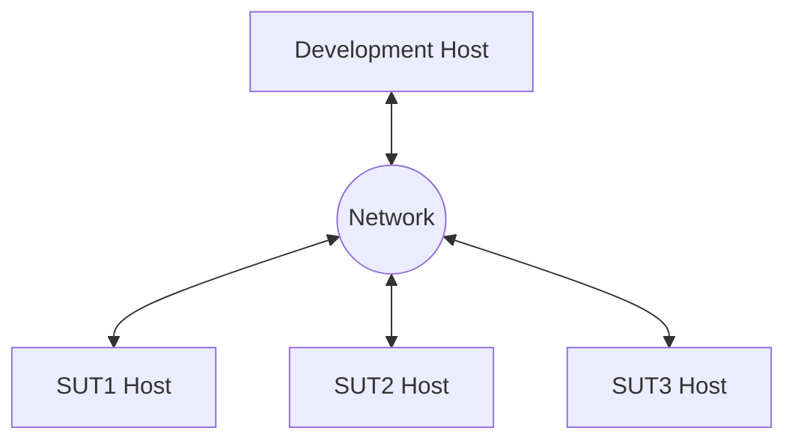
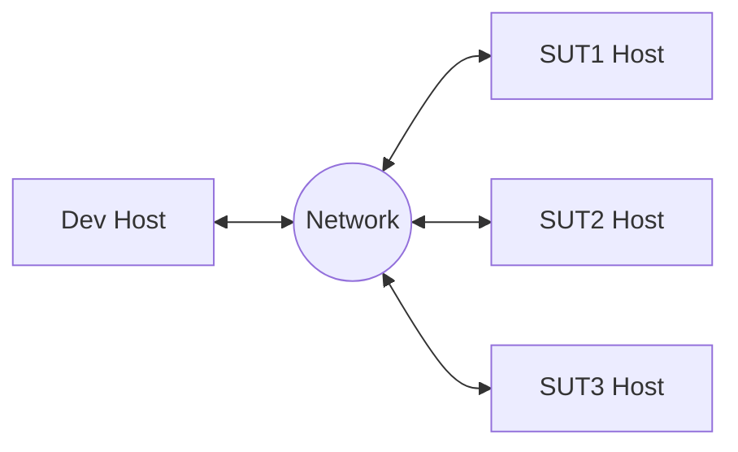
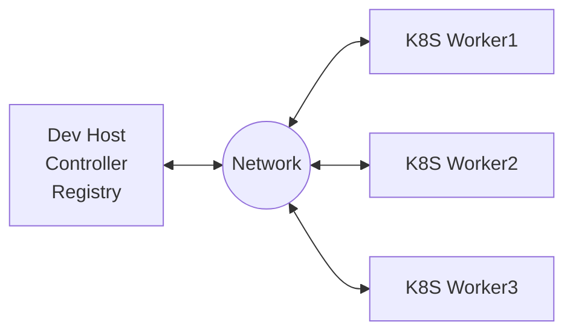
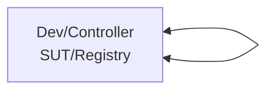
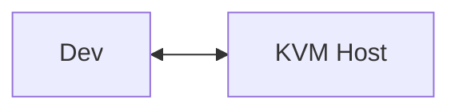

# Setup WSF

This document describes the steps and scripts to setup host environment for workload evaluation and development on the Cloud or On-Premises.

## Network topology

Network topology wise, the WSF assumes that there is a development (dev) machine for workload build and development, and a set of test machines (SUT, or System Under Test) for workload execution, as follows: 



where the SUT machines can be physical hosts in the On-Premesis case, or virtualized VMs in the Cloud or KVM execution. If Kubernetes is used, it is assumed that the SUT hosts form a Kubernetes cluster, where one of the SUTs be the Kubernetes controller.  

For Cloud evaluation, we can usually provision as many VM instances as requried. For the On-Premesis setup, depending on resource constraints, there can be many variations of the above diagram. The followings are some of the common On-Premesis variations:
| Name | Description and Restrictions |
|:-----|:-------------------------|
|Single Dev Default | A single dev machine also serves as a SUT. This is the default if you clone the repository without any changes. This is to quickly evaluate docker and Kubernetes single-container workloads or multiple containers **without any node anti-affinity rules**. The workloads **cannot request any SUT system-level changes**, such as hugepage, sysfs, or sysctls. **Native workloads cannot run in this mode**. Kubernetes uses a single-node setup with the controller untainted for execution, and a private registry (or the WSF official registry) on the same dev machine. **Trace is not functional or accurate** for most telemetry programs. |
|Single Dev with Lookback | A single dev machine also serves as a SUT. Require configuration modification to ssh back to the dev machine for workload execution. This is to evaluate native, docker and Kubernetes single-container workloads or multiple containers workloads **without any node anti-affinity rules**. The workloads can request system-level changes such as hugepage, sysfs, and sysctls **without any reboot of the system or restart of either the containerd, docker or kubelet service**. Kubernetes uses a single-node setup with the controller untainted for execution, and a private registry (or the WSF official registry) on the same dev machine. Most trace programs are functional. |
|Single dev as the Kubernetes controller | The dev machine also serves as a Kubernetes controller with additional Kubernetes worker nodes. This is to evaluate any native, docker and Kubernetes workloads. Must use a private registry (or the WSF official registry) for Kubernetes workload execution. The workloads can request any supported SUT system-level setups. Telemtry collections are fully functional. |
|Dedicated Dev, Kubernetes controller and workers | The dev machine, the Kubernetes controller, and Kubernetes workers are all on dedicated ndoes. This is to evaluate any native, docker and Kubernetes workloads. For Kubernetes workload execution, it is optional to use any private registry. The workloads can request any supported SUT system-level setups. Telemtry collections are fully functional. | 

In general, the WSF can work on any network topology, as long as the dev host can establish ssh (or winrm for Windows) connections to the SUT machines.  

---
- [Prerequisites][Prerequisites]
- [Instructions of Cloud Setup][Instructions of Cloud Setup]
- [Instructions of On-Premises Setup][Instructions of On-Premises Setup]
- [Instructions of KVM Setup][Instructions of KVM Setup]
- [Instructions of ITEP Setup][Instructions of ITEP Setup]
- [Manual of Setup Scripts][Manual of Setup Scripts]
---

## Prerequisites

Ensure that your cluster hosts are properly setup in terms of hostname, networking, proxy and datetime:

- The hostname must be unique within your subnet and follow [RFC-1178][RFC-1178], i.e., matching pattern `[a-z][a-z0-9-]*`. 
- The hostname is properly registered with DNS so that any of your cluster host can reach each other via hostname.
- If you are behind a corporate firewall, please setup `http_proxy`, `https_proxy` and `no_proxy` in `/etc/environment`.
- Sync your host datetime. An accurate system time is required for any credential authentication operations.

## Cloud Setup

To develop or evaluate workloads for Cloud, you need a Linux development machine. The development machine can be used to build workloads and provision Cloud VMs. The workload execution results are saved back to the development machine before publishing to the WSF portal, if specified.      


where the proxy server is optional if the dev host can connect to Internet directly.

| Workload Type  | Docker Registry |  Dev Setup   |  SUT Setup          |  Registry Setup |
|:---------------|:--------:|:-------------|:--------------------|:----------------| 
| `Native`         |   `N/A`    | `setup-dev.sh` | `N/A` | `N/A` |
| `docker/compose` |   `Optional`     | `setup-dev.sh` | `N/A` | `setup-reg.sh`    |
| `Kubernetes`     |   `Optional`     | `setup-dev.sh` | `N/A`    | `setup-reg.sh`    |

Use the following setup steps:
- Run the [`setup-dev.sh`][setup-dev.sh-self] script to setup the development host.  
- Follow the backend specific instructions to initialize Cloud accounts. See [Terraform Cloud Setup][Terraform Cloud Setup].  

> Completely optional in this setup, run the [`setup-reg.sh`][setup-reg.sh-self] script, if you would like to setup a local docker registry for storing images or caching any public registry.      
  
## On-Premises Setup

### Dedicated Dev and SUT

Start with a simple case, where the dev and the SUT hosts are dedicated. This is the recommended setup for simplicity and full functionality. 


where, if Kubernetes is used, the SUT hosts are assumed to form a Kubernetes cluster, where one of the SUT host becomes the Kubernetes controller.  

| Workload Type  | Docker Registry |  Dev Setup   |  SUT Setup          |  Registry Setup |
|:---------------|:--------:|:-------------|:--------------------|:----------------| 
| `Native`         |  `N/A`    | `setup-dev.sh` | `setup-sut-native.sh` | `N/A` |
| `docker/compose` |  `Optional`     | `setup-dev.sh` | `setup-sut-docker.sh` | `setup-reg.sh`    |
| `Kubernetes`     |  `Optional`     | `setup-dev.sh` | `setup-sut-k8s.sh`    | `setup-reg.sh`    |

Use the following setup steps:
- Run the [`setup-dev.sh`][setup-dev.sh-self] script to setup the dev host. 
- Completely optional in this setup, run the [`setup-reg.sh`][setup-reg.sh-self] script (on the dev host), if you plan to setup a local docker registry for building workloads and storing the built images.   
- Depending on the workload types, you can run either the [`setup-sut-native.sh`][setup-sut-native.sh-self], [`setup-sut-docker.sh`][setup-sut-docker.sh-self] script or the [`setup-sut-k8s.sh`][setup-sut-k8s.sh-self] script to setup the SUT hosts. The native setup can run any baremetal native workloads. The docker setup can run most of the single-node containerized workloads (docker or docker compose). The Kubernetes setup can run all containerized workloads (not tied to any Cloud services) on premises. 

---

- Valid for Cloud native workloads only, if you do not setup a local docker registry, please set `k8s_enable_registry: true` in `script/terraform/terraform-config.static.tf`. The terraform backend will auto-create an incluster docker registry to serve any Kubernetes workers. 
- If you do have setup a local docker registry, make sure all SUT hosts can access to the docker registry securely. With [`setup-reg.sh`][setup-reg.sh-self], this is done by appending all SUT hosts to the `setup-reg.sh` command line.  

---

### Combined Dev and Kuberenetes Controller

In this case, you can combine the dev host and the Kubernetes controller to save a physical machine. A valid docker registry is required to serve the docker images to the Kubernetes workers.  



| Workload Type  | Docker Registry |  Dev Setup   |  SUT Setup          |  Registry Setup |
|:---------------|:--------:|:-------------|:--------------------|:----------------| 
| `Native`         |   `N/A`    | `setup-dev.sh` | `setup-sut-native.sh` | `N/A` |
| `docker/compose` |   `Optional`     | `setup-dev.sh` | `setup-sut-docker.sh` | `setup-reg.sh`    |
| `Kubernetes`     |   `Required`    | `setup-dev.sh` | `setup-sut-k8s.sh`    | `setup-reg.sh`    |

Use the following setup steps:  
- Run the [`setup-dev.sh`][setup-dev.sh-self] script on the dev host.  
- If you don't have a private registry, run the [`setup-reg.sh`][setup-reg.sh-self] script to setup a private registry on the dev host. Make sure you append your SUT hosts to the command line so that the SUT hosts can securely access the private docker registry.    
- Run the [`setup-sut-k8s.sh`][setup-sut-k8s.sh-self] script to setup the workers. Use the dev host IP address as the controller IP address.  

---

- Use `cmake -DREGISTRY=<registry_url> ..` to set the private registry URL.  
- Set `k8s_enable_registry: false` in `script/terraform/terraform-config.static.tf`. This is the default. 

---

### Single Host Dev+SUT

In a constrained environment, you can combine the dev and SUT hosts all onto the same physical host. The SUT access is through either the ansible local connection or a loop-back ssh connection. Please note that this is only for quick evaluation, the WSF scripts will not be able to perform automations that lead to reboot of the system, or restart of the containerd, dockerd, or kubelet service. 



| Workload Type  | Docker Registry |  Dev Setup   |  SUT Setup          |  Registry Setup |
|:---------------|:--------:|:-------------|:--------------------|:----------------| 
| `Native`         |   `N/A`    | `setup-dev.sh` | `setup-sut-native.sh` | `N/A`             |
| `docker/compose` |   `Optional`     | `setup-dev.sh` | `setup-sut-docker.sh` | `setup-reg.sh`    |
| `Kubernetes`     |   `Required`    | `setup-dev.sh` | `setup-sut-k8s.sh`    | `setup-reg.sh`    |

Use the following setup steps:  
- Run the [`setup-dev.sh`][setup-dev.sh-self] script on the development host: 
- If a registry is required, run the [`setup-reg.sh`][setup-reg.sh-self] script on the dev host. Append all SUT info on the setup-reg.sh command line so that the SUTs can access to the registry securely.    
- Run either the [`setup-sut-native.sh`][setup-sut-native.sh-self], [`setup-sut-docker.sh`][setup-sut-docker.sh-self] script or the [`setup-sut-k8s.sh`][setup-sut-k8s.sh-self] script to setup the workers. As there is only a single physical host in this setup, only workloads that require a single SUT can proceed.
  
---

- Use `cmake -DREGISTRY=<registry_url> ..` to set the private registry URL.
- If you use ssh loopback, modify the dev machine username and IP address in `script/terraform/terraform-config.static.tf`. 
- If the host has enough CPU cores and memory, suggest to use the KVM development setup for more flexibility.

---

## KVM Setup

To evaluate workloads with KVM, you need a Linux dev machine and a KVM host. The KVM host can create as many VMs that can be used as the SUTs. 



| Workload Type  | Docker Registry |  Dev Setup   |  SUT Setup          |
|:---------------|:--------:|:-------------|:--------------------| 
| `Native`         |   `N/A`    | `setup-dev.sh` | `setup-sut-kvm.sh`    |
| `docker/compose` |   `Optional`     | `setup-dev.sh` | `setup-sut-kvm.sh`    |
| `Kubernetes`     |   `Optional`     | `setup-dev.sh` | `setup-sut-kvm.sh`    |

Use the following setup steps:  
- Make sure `Virtualization` is turned on in your KVM host BIOS. 
- Run the [`setup-dev.sh`][setup-dev.sh-self] script to setup the dev host.  
- Run the [`setup-sut-kvm.sh`][setup-sut-kvm.sh-self] script to setup the KVM host.  

---

- Use `cmake -DTERRAFORM_SUT=kvm ..` to use the kvm setup.
> HINT: To execute KVM setup for a specific workload, run the following command such as ```cmake -DTERRAFORM_SUT=kvm -DPLATFORM=SPR -DBENCHMARK=OpenSSL3-RSAMB ../ ```
- Modify the IP address and credentials of your KVM host in `script/terraform/terraform-config.kvm.tf`.  

---

## ITEP Setup

To evaluate workloads with ITEP, you need to make sure ITEP is already deployed and status of edge cluster is already active. 

Use the following setup steps:  
- Run the [`setup-itep.sh`][setup-itep.sh-self] script to install all necessary prerequisites.  

---

- Use `cmake -DTERRAFORM_SUT=itep ..` to use the ITEP setup.
> HINT: To execute ITEP setup for a specific workload, run the following command such as ```cmake -DTERRAFORM_SUT=itep -DPLATFORM=SPR -DBENCHMARK=OpenSSL3-RSAMB ../ ```

---

## Setup Scripts
> Note: All scripts mentioned below, such as setup-dev.sh, setup-sut-kvm.sh, etc, are found inside ```script/setup/``` and must be executed from there.
- **[`setup-dev.sh`][setup-dev.sh-self]**: Setup the dev host.   
- **[`setup-reg.sh`][setup-reg.sh-self]**: Setup a private docker registry.   
- **[`setup-sut-native.sh`][setup-sut-native.sh-self]**: Setup the SUT host for native workload execution.  
- **[`setup-sut-docker.sh`][setup-sut-docker.sh-self]**: Setup the SUT host for docker/docker-compose workload execution.  
- **[`setup-sut-k8s.sh`][setup-sut-k8s.sh-self]**: Setup the SUT host for Kubernetes workload execution.  
- **[`setup-sut-kvm.sh`][setup-sut-kvm.sh-self]**: Setup the KVM host.  
- **[`setup-itep.sh`][setup-itep.sh-self]**: Install all necessary prerequisites for ITEP.  

### setup-dev.sh

The [`setup-dev.sh`][setup-dev.sh] script creates the host environment for building workloads and evaluating workloads. 
The script does not have any arguments and performs the following options underneath:
- Install Intel certificates.
- Install packages: `cmake`, `make`, `m4`, and `gawk`. These are minimum system requirements.
- Install and setup [`docker`][docker] on your host. 
- Add an alias `ctest=./ctest.sh` to your `~/.bashrc`.  

```
Usage: [options]
```
where `options` are:
- `--nodaemonize`: Do not install daemonize.
- `--no-password`: Do not ask for password. Use environment variable DEV_SUDO_PASSWORD where password is required.  

> The script requires sudo privilege. After the setup, for any changes to take effect, you must **logout of the current ssh session** and relogin the development host.   

### Setup-reg.sh

The [`setup-reg.sh`][setup-reg.sh] script can help to create a private docker registry or a pass-through registry on the development host. The private docker registry can be used to save rebuilt docker images. A pass-through registry can provide a cached mirror to any official registries.  

```
Usage: [options] <user>@<hostname|ip>[:port] [<user>@<host>...]
```
where `options` are:
- `--port`: Specify the SSH port number. Default 22.  
- `--force`: Force replacing any existing certificate.  
- `--no-password`: Do not ask for password. Use environment variable DEV_SUDO_PASSWORD, SUT_SUDO_PASSWORD, and/or SUT_SSH_PASSWORD where password is required.  

The mandated argument is the hostname or IP of the registry URL. The port is optional. The default port for a docker registry is 20666 and the default port for a pass-through registry is 20690. You can create both on the same host if required.   

If a list of `<user>@<host>` is specified, the script will copy the registry certificate to the machines so that they can securely access the newly created docker registry.  

> Examples:

```
# Create a docker registry on my host xx.yy.zz
script/setup/setup-reg.sh xx.yy.zz
```

After the setup, you can set the `REGISTRY` value to be the registry URL, in the form of `<hostname|ip>:<port>`.  

```shell
# Setup to use the docker registry
cd build
cmake -DREGISTRY=xx.yy.zz:20666 ..
```

### setup-sut-native.sh
  
The [`setup-sut-native.sh`][setup-sut-native.sh] script creates the host environment for baremetal native workload execution. The script takes the following arguments:

```
Usage: [options] <user@worker1-ip> [user@worker2-ip ...]
```
where `options` are:
- `--port`: Specify the SSH port number. Default 22.  
- `--no-password`: Do not ask for password. Use environment variable DEV_SUDO_PASSWORD, SUT_SUDO_PASSWORD, and/or SUT_SSH_PASSWORD where password is required.  

### setup-sut-docker.sh
  
The [`setup-sut-docker.sh`][setup-sut-docker.sh] script creates the host environment for docker execution. The script takes the following arguments:

```
Usage: [options] <user@worker1-ip>
```
where `options` are:
- `--port`: Specify the SSH port number. Default 22.  
- `--nointelcert`: Do not install Intel certificates.  

### setup-sut-k8s.sh
  
The [`setup-sut-k8s.sh`][setup-sut-k8s.sh] script creates the host environment for Kubernetes. The script takes the following arguments:

```
Usage: [options] <user@controller-ip[:private_ip]> <user@worker1-ip[:private_ip]> [<user>@worker2-ip[:private_ip]> ...]
```
where `options` are:
- `--port`: Specify the SSH port number. Default 22.  
- `--nointelcert`: Do not install Intel certificates.  
- `--no-password`: Do not ask for password. Use environment variable DEV_SUDO_PASSWORD, SUT_SUDO_PASSWORD, and/or SUT_SSH_PASSWORD where password is required.  
- `--worker`: Switch to the worker group. 
- `--client`: Switch to the client group. 
- `--controller`: Switch to the controller group.  

### setup-sut-kvm.sh

The [`setup-sut-kvm.sh`][setup-sut-kvm.sh] script creates the host environment for the KVM execution. The script takes the following arguments:

```
Usage: [options] <user@ip[:dev]> [<user@ip>[:dev] ...]
```

where `options` are:
- `--port`: Specify the SSH port number. Default 22.  
- `--hugepage`: Specify the hugepage setup as hugepagesz/hugepages, for example, 2M/8192 or 1G/16.  
- `--reboot`: Reboot the SUT after the setup.  
- `--mtu <value>`: Specify the VXLAN MTU value. 
- `--dev <value>`: Specify the VXLAN interface device. 
- `--vxlan`: Setup VXLAN among multiple KVM hosts. 
- `--reset`: Force re-installing KVM and VXLAN.  
- `--no-password`: Do not ask for password. Use environment variable DEV_SUDO_PASSWORD, SUT_SUDO_PASSWORD, and/or SUT_SSH_PASSWORD where password is required.  

### setup-itep.sh

The [`setup-itep.sh`][setup-itep.sh] script install all necessary prerequisites for ITEP setup. The script takes the following arguments:

```
Usage: <ITEP_fqdn> <username>
```

[Instructions of Cloud Setup]: #cloud-setup
[Instructions of On-Premises Setup]: #on-premises-setup
[Instructions of KVM Setup]: #kvm-setup
[Instructions of ITEP Setup]: #itep-setup
[Manual of Setup Scripts]: #setup-scripts
[Prerequisites]: #prerequisites
[RFC-1178]: http://www.faqs.org/rfcs/rfc1178.html

[Terraform Cloud Setup]: setup-terraform.md#configure-cloud-account
[docker]: setup-docker.md

[setup-dev.sh-self]: #setup-devsh
[setup-reg.sh-self]: #setup-regsh
[setup-sut-docker.sh-self]: #setup-sut-dockersh
[setup-sut-k8s.sh-self]: #setup-sut-k8ssh
[setup-sut-native.sh-self]: #setup-sut-nativesh
[setup-sut-kvm.sh-self]: #setup-sut-kvmsh

[setup-dev.sh]: ../../../script/setup/setup-dev.sh
[setup-reg.sh]: ../../../script/setup/setup-reg.sh
[setup-sut-docker.sh]: ../../../script/setup/setup-sut-docker.sh
[setup-sut-k8s.sh]: ../../../script/setup/setup-sut-k8s.sh
[setup-sut-kvm.sh]: ../../../script/setup/setup-sut-kvm.sh
[setup-sut-native.sh]: ../../../script/setup/setup-sut-native.sh
