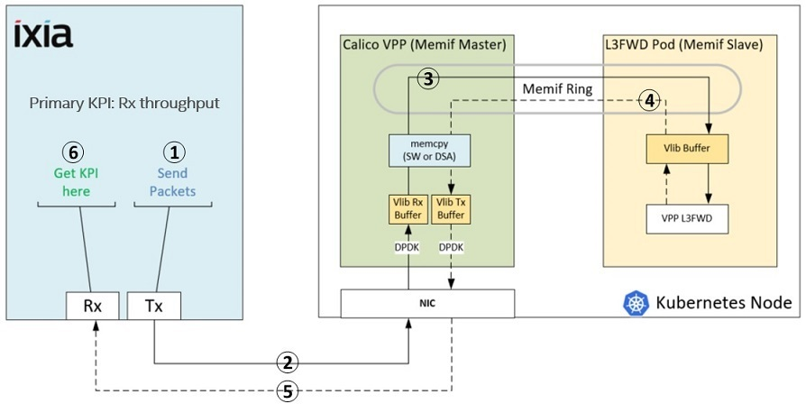

# Calico VPP with Intel® DSA Tuning Guide on 4th Gen Intel® Xeon® Scalable Processors

## Introduction

This guide is for users who are already familiar with Calico VPP and Intel® DSA accelerator. It provides recommendations for configuring hardware and software that will provide the best performance in most situations. However, please note that we rely on the users to carefully consider these settings for their specific scenarios, since Calico VPP can be deployed in multiple ways. 

[Calico VPP](https://projectcalico.docs.tigera.io/getting-started/kubernetes/vpp/getting-started) is one of Calico dataplanes, which takes advantages of VPP to scale higher throughput in K8S cloud native environment. It's easily extensible using VPP plugins such as DPDK, IPSec, etc. Calico VPP provides memif userspace packet interfaces to the K8S pods and exposes the VPP Host Stack to run optimized L4+ applications in K8S pods. This testing is based on Calico VPP version 3.23.0.

4th Gen Intel® Xeon® Scalable processors deliver workload-optimized performance with built-in acceleration for AI, encryption, HPC, storage, database systems, and networking. They feature unique security technologies to help protect data on-premises or in the cloud.

- New built in accelerators for AI, HPC, Networking, Security, Storage and Analytics
- Intel® Ultra Path Interconnect (Intel® UPI)
- Intel® Speed Select Technology
- Hardware-enhanced security 
- New flex bus I/O interface (PCIe 5.0 + CXL) 
- New flexible I/O interface up to 20 HSIO lanes (PCI 3.0)
- Increased input/output (I/O) bandwidth with PCIe 5.0 (up to 80 lanes) 
- Increased memory bandwidth with DDR5 
- Increased multi-socket bandwidth with UPI 2.0 (up to 16 GT/s) 
- Support for Intel Optane PMem 300 series 

### Server Configuration

#### Hardware

The configuration described in this article is based on 4th Gen Intel® Xeon® processor hardware. The server platform, memory, hard drives, and network interface cards can be determined according to your usage requirements.

| Hardware | Model |
|----------------------------------|------------------------------------|
| System | Intel Corporation M50FCP2SBSTD |
| Baseboard | Intel Corporation M50FCP2SBSTD |
| CPU Model | Intel(R) Xeon(R) Platinum 8480+ |
| BIOS | SE5C6301.86B.7827.D12.2206020255 |
| Memory | 512GB (16x32GB 4800 MT/s [4800 MT/s]) |
| Storage/Disks | 1x 894.3G Micron_5300_MTFD |
| NIC | 1x Ethernet Controller E810-C for QSFP, 1x Ethernet interface |

#### Software

| Software | Version |
|------------------|-------------|
| Operating System | Ubuntu 22.04 LTS 
| Kernel | 5.15.0-48-generic |
| Calico VPP Version | 3.23.0 |
| VPP Version | 22.02 |
| DPDK Version | 21.11.0 |
| Docker Version | 20.10.18 |
| Kubernetes Version | 1.23.12 |
| Hugepage Size | 1048576 kB |
| Hugepages | 16 |
| Isolcpus | 0-27, 112-139, 56-83, 168-195 |
| grub command line  | BOOT_IMAGE=/vmlinuz-5.15.0-48-generic root=/dev/mapper/ubuntu--vg-ubuntu--lv ro default_hugepagesz=1G hugepagesz=1G hugepages=16 intel_iommu=on iommu=on isolcpus=0-27,112-139,56-83,168-195 |


## Hardware Tuning

### BIOS Settings

Begin by resetting your BIOS to default setting, then follow the suggestions below for changes to the default:

| Configuration Item | Recommended Value
|---------------------|------------------|
| Advanced/Power & Performance/CPU P State Control/Energy Efficient Turbo | Enabled |
| Advanced/Power & Performance/CPU P State Control/Intel(R) Turbo Boost Technology | Enabled |
| Advanced/Power & Performance/Hardware P States/Hardware P-States | Native Mode |
| Advanced/Power & Performance/CPU C State Control/Package C State | C0/C1 state |
| Advanced/Power & Performance/CPU Power and Performance Policy | Performance |
| Advanced/Memory Configuration/Memory RAS and Performance Configuration/SNC | Disabled |

### Memory Configuration/Settings

Need at least 16 * 1G hugepages for this testing since 1GB huagepage size can achieve better performance than default 2MB huagepage size.

### Storage/Disk Configuration/Settings

No specific workload setting.

### Network Configuration/Setting

Need at least 2 NICs, NIC1 is the management network used to manage SPR server, for example, ssh to SPR server, run workload scripts to install environment, build images, configure K8S environment, etc. NIC2 is the testing network which should be connected to IXIA server directly and the bandwidth of NIC2 should be >= 100Gbps, K8S will be configured on NIC2.


## Software Tuning

Software configuration tuning is essential. From the operating system to Calico VPP configuration settings, they are all designed for general purpose applications and default settings are almost never tuned for best performance.

### Linux Kernel Optimization Settings

Run below command to setup CPU runs on performance mode,
```
echo "performance" | sudo tee /sys/devices/system/cpu/cpu*/cpufreq/scaling_governor
```

### Calico VPP Test Architecture and Data Flow

#### Test Architecture



#### Data Flow

1. IXIA generates packets
2. IXIA sends packets to Calico VPP
3. Calico VPP routes packets to VPP L3FWD pod via memif interface
4. VPP L3FWD forwards packets back to Calico VPP via memif interface
5. Calico VPP routes packets back to IXIA
6. Capture throughput data on IXIA side

### Calico VPP Interfaces

Calico VPP supports memif interface to improve packets transmission performance between memif master and slave, we call this kind of memif interface is software(SW) memif since it uses CPU to copy memory data from memif master to slave. If DSA is enabled on memif interface, we call it's DSA memif because it will use DSA instead of CPU to copy memory data. Calico VPP also supports TUN interface, in this case, packet goes through the kernel as it travels between VPP and pods. So, there are 3 typical testing scenarios, SW memif interface testing , DSA memif interface testing and TUN interface testing.

### Calico VPP Testing Requirements

1. A SPR server with OS Ubuntu 22.04 is ready
2. At least 16 x 1GB hugepages on SPR server are available (See above "grub command line" settings.)
3. At least one DSA device on SPR server is available (**Note**: DSA memif needs this requirement, no need for SW memif and TUN.)
4. SWAP on SPR server is disabled
5. SPR server can access internet to download related source code and packages for environment installation (Perhaps need to setup environment variable "http_proxy", "https_proxy" and "no_proxy" correctly. **Note**: Make sure that private IPv4 address which connected to IXIA server has been added in "no_proxy" environment.)
6. An IXIA server is connected to SPR server directly
7. Configure isolcpus parameters (Optional requirement, see above "grub command line" settings.)

### Calico VPP Tuning

This chapter describes how to prepare testing environment and how to start testing on IXIA console, includes below sections,
- Install Environment
- Build Calico VPP Images
- Configure K8S and VPP L3FWD
- Start Testing on IXIA Console

### Install Environment

Copy source code of this workload to SPR server, run below command to install environment,
```
./install_env.sh
```
This script will check and install necessary components, such as Golang, Docker, K8S, DPDK tool, etc. After installation, will output below similar messages,
```
...
2022-12-07 15:48:31 [INFO] Checking installation status...
2022-12-07 15:48:31 [INFO] Golang has been installed - OK
2022-12-07 15:48:31 [INFO] Docker has been installed - OK
2022-12-07 15:48:31 [INFO] Docker service has been started - OK
2022-12-07 15:48:31 [INFO] K8S has been installed - OK
2022-12-07 15:48:31 [INFO] DPDK tool has been installed - OK
```

**Note**: For the first installation, please logout current shell session and open a new session to continue next steps.

### Build Calico VPP Images

Run below command to build testing related docker images,
```
./build_images.sh
```
 After building, will output below similar messages,
 ```
 ...
2022-12-08 14:52:55 [INFO] Calico VPP with DSA related images:
calicovpp_dsa_vppl3fwd_tun              v1                       cd9474ef375e   1 second ago     478MB
calicovpp_dsa_vppl3fwd_memif            v1                       1358445c533a   7 minutes ago    479MB
calicovpp_dsa_vpp                       v1                       3d33a94aa2e7   17 minutes ago   350MB
calicovpp_dsa_agent                     v1                       a35af9c25da5   23 minutes ago   208MB
 ```

**Note**: Please be aware of below permission requirements for above images and check if it's OK for you to continue install this workload,
- calicovpp_dsa_vpp:v1 and calicovpp_dsa_agent:v1 will be running under root account with container privileged permission, this is controlled by original Calico VPP source code.
- calicovpp_dsa_vppl3fwd_memif:v1 and calicovpp_dsa_vppl3fwd_tun:v1 will be running under root account with container privileged permission, because the base image is "calicovpp/vpp:v3.23.0" which runs under root account.

### Configure K8S and VPP L3FWD

Run below command to configure K8S with DSA memif interface and VPP L3FWD testing environment,
```
./config_env.sh --mode dsa --ipv4 <IPv4 address>
```
- --mode: Specify configuration mode, value can be "dsa", "sw" or "tun"
- --ipv4: Specify IPv4 address on which K8S will be installed, it's the SPR server private IPv4 address and the NIC associated with this IPv4 address should be at least 100Gbps bandwidth

After configuration, will output below similar messages,
```
...
2022-12-08 15:03:55 [INFO] Succeed to configure K8S, below are configuration parameters:
Configuration mode: dsa
K8S controller IP address: 192.168.0.11
NIC interface: ens785f0
NIC interface pci: 0000:38:00.0
MTU: 1500
K8S pod CIDR: **.***.0.0/16
DSA device: 6a:01.0
Core numbers: 1
VPP cores start: 0
L3FWD cores start: 16
VPP neighbor ip: **.**.**.1
VPP L3FWD pod ipv4 address: ***.***.***.***
Calico VPP MAC address: b4:96:**:**:**:**
Packet source IPs range: **.**.10.1/24
Packet source MAC address: 10:00:00:00:00:00
```

Below parameters will be used for the testing on IXIA side,
```
VPP L3FWD pod ipv4 address: ***.***.***.***
Calico VPP MAC address: b4:96:**:**:**:**
Packet source IPs range: **.**.10.1/24
Packet source MAC address: 10:00:00:00:00:00
```

Please run below command to get more details of configuration arguments,
```
./config_env.sh -h
```

If you need to configure another testing scenario, for example, SW memif, please run below command to reset K8S firstly, then configure K8S with correct arguments again,
```
./reset_env.sh
```

### Start Testing on IXIA Console

Before this part, please check below items,
- IXIA server has been connected to SPR server
- IXIA console software (IxNetwork 9.20) has been installed on Windows OS
- IXIA server has been added into IXIA console with correct 1 port

Next, follow below steps to create a traffic for testing,
1. Click "Traffic" label on the left panel of IXIA console, then click "Add L2-3 Traffic Items".
2. On "Endpoints" section, select "Raw" traffic type and add an endpoint by selecting both source and destination ports.
3. On "Packet / QoS" section, expand "Ethernet II" -> "Ethernet Header". Change value "Destination MAC Address" to parameter "Calico VPP MAC address" above. Change value "Source MAC Address" to parameter "Packet source MAC address" above. Change value "Ethernet-Type" to "0x800".
4. On "Packet / QoS" section, add "IPv4" protocol and expand "IPv4" -> "IP Header". Change value "Destination Address" to parameter "VPP L3FWD pod ipv4 address" above. Change value "Source Address" according to parameter "Packet source IPs range" above, "Source Address" can be any single IPv4 address for single core testing, "Source Address" should be IPv4 multi addresses (Choose "Increment" or "Decrement" type, recommended count value is "128") for multi cores testing.
5. On "Packet / QoS" section, add "TCP" protocol and expand "TCP" -> "TCP Header". Change value "TCP-Dest-Port" to 10000. (**Note**: Adding TCP protocol is only for DSA meminf interface and SW memif interface testing, do not set it for TUN interface testing)
6. On "Frame Setup" section, choose "Fixed" option and input a frame size number according to testing scenario, for example, 1024. (**Note**: DONOT set frame size which is greater than MTU, otherwise, may cause Calico VPP crash.)
7. On "Rate Setup" section, choose "Line Rate" and input 100 for 100% line rate testing.
8. On "Flow Tracking" section, select "Traffic Item".
9. Click "Finish" button.

Right click "L2-3 Flow Groups" on the left panel and select "Start L2-3 Traffic" to start the testing, then capture throughput data "Rx L1 Rate (bps)" on "Traffic Item Statistics" tab of IXIA console.

## Related Tools and Information

- Tools htop and perf can be used to monitor SPR server resources usage and function call stacks information, emon can be used to analyze CPU runtime metric data.
- Running command "calivppctl vppctl" can go into Calico VPP space to check Calico VPP status, such as "show interface", "show memif", etc.
- Running command "kubectl exec -it vpp-l3fwd -- bash" and "vppctl -s /run/vpp/cli-vpp-l3fwd.sock" can go into L3FWD VPP space to check L3FWD status, such as "show interface".

## Conclusion

This article describes how to install, build and deploy Calico VPP with Intel® DSA accelerator testing environment and how to configure testing parameters on IXIA console. According to this article, we can easily set up DSA memif interface, SW memmif interface and TUN interface testing environments and then obtain throughput data under different MTU, packet sizes and CPU cores.

## References
- [Calico VPP Getting Started](https://projectcalico.docs.tigera.io/getting-started/kubernetes/vpp/getting-started) 
- [VPP Dataplane Configurations and Architecture ](https://projectcalico.docs.tigera.io/reference/vpp/) 

## Feedback

We value your feedback. If you have comments (positive or negative) on this guide or are seeking something that is not part of this guide, please reach out and let us know what you think. 
 