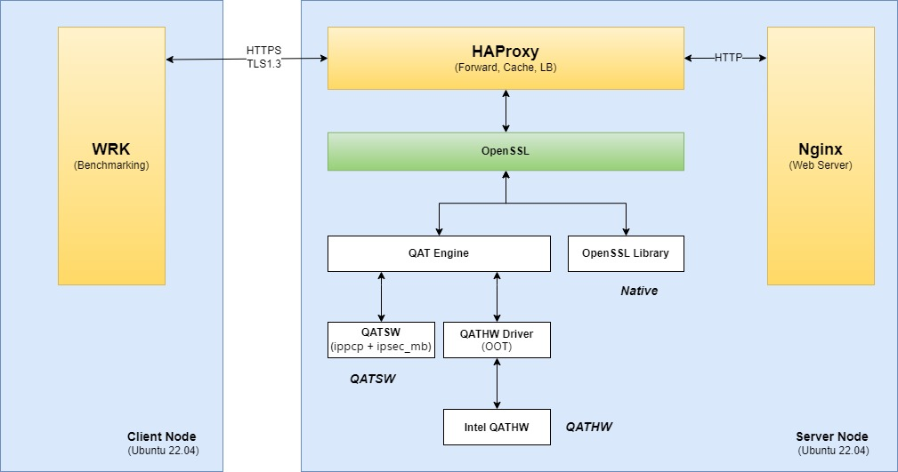

# HAProxy with Intel® QuickAssist Technology (Intel® QAT) Tuning Guide

## Introduction

This guide is for users who are already familiar with HAProxy and Intel® QuickAssist Technology (Intel® QAT). It provides recommendations for configuring hardware and software that will provide the best performance in most situations. However, please note that we rely on the users to carefully consider these settings for their specific scenarios.

[HAProxy](https://www.haproxy.org/) is an open-source software load balancer and reliable reverse proxy, continuously optimized to run on Intel® Xeon® processors.

Intel® QAT is one of the built-in accelerators and is designed for speeding up cryptography including private key protection, and data decompression. It offloads cryptography functions from the processor, the accelerator helps systems serve a larger number of clients.

Intel® Advanced Vector Extensions 512 (Intel® AVX-512)  is the latest Intel architecture processor vector instruction set, with up to two fused multiply add (FMA) units and other optimizations to help accelerate the performance of demanding computational tasks. These vectorized instructions used in software acceleration libraries: [Intel® IPP Cryptography](https://github.com/intel/ipp-crypto.git) and [Intel® Multi-Buffer Crypto for IPsec](https://github.com/intel/intel-ipsec-mb.git) with Intel® QAT Engine for OpenSSL, provide the computational power for HAProxy.


### System Configuration

#### Hardware

The configuration described in this article is based on 4th or 5th Gen Intel® Xeon® processor hardware. The server platform, memory, hard drives, and network interface cards can be determined according to your usage requirements.

4th Gen Intel® Xeon® processor hardware
| Hardware | Model |
|----------------------------------|------------------------------------|
|System|Intel Corporation M50FCP2SBSTD|
|Baseboard|Intel Corporation M50FCP2SBSTD|
|CPU Model|Intel(R) Xeon(R) Platinum 8480+|
|BIOS|SE5C7411.86B.9525.D18.2303071632|
|Memory|512GB (16x32GB DDR5 4800 MT/s [4800 MT/s])|
|Storage/Disks|1x 894.3G Micron_5300_MTFD|
|NIC|4x Ethernet Controller E810-C for QSFP (1 port for HAProxy Server)|

5th Gen Intel® Xeon® processor hardware
| Hardware | Model |
|----------------------------------|------------------------------------|
|System|Intel Corporation ArcherCity|
|Baseboard|Intel Corporation ArcherCity|
|CPU Model|INTEL(R) XEON(R) PLATINUM 8592+|
|BIOS|EGSDCRB1.86B.0105.D74.2308261927|
|Memory|512GB (16x32GB DDR5 5600 MT/s [5600 MT/s])|
|Storage/Disks|1x 465.8G Hitachi HTS72505|
|NIC|4x Ethernet Controller E810-C for QSFP (1 port for HAProxy Server)|

#### Software

| Software | Version |
|------------------|-------------|
|Operating System |Ubuntu 22.04 LTS 
|HAProxy|v2.8.0
|WRK|4.2.0
|Nginx|1.25.1
|OpenSSL|1.1.1u
|TLS|1.3
|QAT_Engine|v1.2.0
|IPP Crypto|ippcp_2021.7.1
|IPSec MB|v1.3
|QAT Hardware Driver|[QAT20.L.1.0.50-00003](https://www.intel.com/content/www/us/en/download/765501/intel-quickassist-technology-driver-for-linux-hw-version-2-0.html) (for HW Version 2.0) / [QAT.L.4.19.0-00005](https://www.intel.com/content/www/us/en/download/19734/743650/intel-quickassist-technology-driver-for-linux-hw-version-1-x.html) (for HW Version 1.X)
|Compiler|gcc version 11.4.0 (Ubuntu 11.4.0-1ubuntu1~22.04)
|Cipher Suite|TLS_AES_256_GCM_SHA384
|Certificate|RSA2048
|grub command line  | BOOT_IMAGE=/vmlinuz-5.15.0-73-generic root=/dev/mapper/ubuntu--vg-ubuntu--lv ro default_hugepagesz=2M hugepagesz=2M hugepages=4096


## Hardware Tuning

### BIOS Settings

Begin by resetting your BIOS to default setting, then follow the suggestions below for changes to the default,

| Configuration Item | Recommended Value
|---------------------|------------------|
|Intel(R) VT for Directed I/O|Enable
|SncEn| Disable
|Hyper Threading| Enable
|Intel(R) Turbo Boost Technology| Enable

## Software Tuning

Software configuration tuning is essential. From the operating system to HAProxy configuration settings, they are all designed for general purpose applications and default settings are almost never tuned for best performance.

### Test Architecture and Scenarios

#### Test Architecture


#### Scenarios
1. Native Mode: HAProxy uses native OpenSSL crypto stack to encrypt/decrypt TLS traffic.
2. QATSW Mode: Crypto operation will be set to optimized software path(IPP Crypto & IPSet MB Library) by Intel® QAT Engine for OpenSSL.
3. QATHW Mode: Crypto operation will be offloaded to Intel® QAT hardware accelerator by Intel® QAT Engine through device driver.


### Linux Kernel Optimization Settings

Use [CommsPowerManagement](https://github.com/intel/CommsPowerManagement.git) to set core and uncore frequency and cpu performance governer according to your testing scenario.
Below is an example to set core and oncore frequncy to 1.9GHz and the performance mode,
```shell
sudo python3 CommsPowerManagement/power.py -M 1900 -m 1900 -U 1900 -u 1900 -g performance
```

### Install Environment

**Note:** Before this step, please make sure you have configured environment variable "https_proxy", "http_proxy" and "no_proxy" correctly.

Copy source code of this workload to SUTs, run `install.sh` to install environment.

On HAProxy server,
``` shell
sudo ./install.sh --role server
```
This script will check and install necessary components, such as OpenSSL, HAProxy, QAT Driver, etc. 

On WRK client,
``` shell
sudo ./install.sh --role client
```

## Start Testing

### Config HAProxy Server
`config.sh` is used to configure HAProxy server, this is an necessary step before testing. Execute below command to show usage and command examples,
```shell
./config.sh -h
```
You can use `config.sh` to configure HAProxy server multiple times.
For example, after you configured Native mode, you can also use this script with corresponding parameters to configure QATSW or QATHW mode.

### Start Testing on WRK Client
[wrk](https://github.com/wg/wrk.git) is a modern HTTP benchmarking tool which can be used to measure RPS(requests/second), throughput and latency of HAProxy.

Below are command options,
```
-c, --connections: total number of HTTP connections to keep open with
                   each thread handling N = connections/threads
-d, --duration:    duration of the test, e.g. 2s, 2m, 2h
-t, --threads:     total number of threads to use
-s, --script:      LuaJIT script, see SCRIPTING
-H, --header:      HTTP header to add to request, e.g. "User-Agent: wrk"
    --latency:     print detailed latency statistics
    --timeout:     record a timeout if a response is not received within
                   this amount of time.
```
Below are wrk command line examples,
```shell
taskset -c 0-15 wrk -t 16 -c 1600 -d 30s --timeout 30s --latency https://<HAProxy_Server_IP>:<HAProxy_Port>/handshake
taskset -c 0-15 wrk -t 16 -c 1600 -d 30s --timeout 30s --latency https://<HAProxy_Server_IP>:<HAProxy_Port>/data_1MB
```

### Uninstall HAProxy Testing Environment
Below command can be used to uninstall HAProxy testing environment,
```shell
sudo ./uninstall.sh -y
```

## Typical Testing Scenario Examples
### Example1: Benchmark HAProxy 8C16T QATHW Handhsake Performance
**Configure HAProxy Server** <br>
Run below command on HAProxy server machine,
```shell
./config.sh --mode qathw --haproxy-cores 65-72,193-200 --haproxy-nbthread 16 --nginx-cores 96-103,224-231 --nginx-workers 16 --haproxy-http-keep-alive false --bind-irq-devices ens801f0 -y
```
**Start Testing on WRK Client** <br>
Run below command on WRK client machine,
```shell
taskset -c 0-15 wrk -t 16 -c 1600 -d 30s --timeout 30s --latency https://192.168.39.39:9000/handshake
```
wrk will produce similar output:
```text
Running 30s test @ https://192.168.39.39:9000/handshake
16 threads and 1600 connections
Thread Stats   Avg      Stdev     Max   +/- Stdev
    Latency     2.59ms    1.42ms  19.83ms   62.06%
    Req/Sec     1.04k    76.40     2.36k    72.79%
Latency Distribution
    50%    2.56ms
    75%    3.68ms
    90%    4.47ms
    99%    5.85ms
498163 requests in 30.08s, 120.67MB read
Requests/sec:  16559.14
Transfer/sec:      4.01MB
```
Handshake performance is shown in `Requests/sec`, higher is better.

**Note:** Above output is only used to show how to capture handshake result, not represent the official performance data.

### Example2: Benchmark HAProxy 4C8T QATSW Throughput Performance
**Configure HAProxy Server** <br>
Run below command on HAProxy server machine,
```shell
./config.sh --mode qatsw --haproxy-cores 65-68,193-196 --haproxy-nbthread 8 --nginx-cores 96-103,224-231 --nginx-workers 16 --haproxy-http-keep-alive true --bind-irq-devices ens801f0 -y
```
**Start Testing on WRK Client** <br>
Run below command on WRK client machine,
```shell
taskset -c 0-7 wrk -t 8 -c 400 -d 30s --timeout 30s --latency https://192.168.39.39:9000/data_1MB
```
 wrk will produce similar output:
```text
Running 30s test @ https://192.168.39.39:9000/data_1MB
  8 threads and 400 connections
  Thread Stats   Avg      Stdev     Max   +/- Stdev
    Latency    65.60ms   15.46ms 392.38ms   86.97%
    Req/Sec   760.96     53.35     0.97k    67.83%
  Latency Distribution
     50%   62.71ms
     75%   69.78ms
     90%   89.04ms
     99%   96.60ms
  181769 requests in 30.02s, 177.71GB read
Requests/sec:   6054.43
Transfer/sec:      5.92GB
```
Throughput performance is shown in `Transfer/sec` as GBps, higher is better.
To convert GBps to Gbps, you need to multiply the output with `1.024^3*8` (For example: 5.92GBps = 5.92 * 1.024^3 * 8 = 50.85Gbps)

**Note:** Above output is only used to show how to capture throughput result, not represent the official performance data.

Supported file size for throughput case: data_1KB,data_2KB, data_4KB, data_10KB, data_100KB, data_512KB, data_1MB, data_2MB, data_4MB, data_10MB.

## Related Tools and Information

- `htop` and `perf` can be used to monitor server resources usage and function call stacks information, `emon` can be used to analyze CPU runtime metric data.
- `adf_ctl` is the QAT hardware accelerator management interface provided by QAT driver.
Usage of adf_ctl: `adf_ctl [qat_dev<N>] status` - to print device(s) status; `adf_ctl [-c|--config] [qat_dev<N>] [up | down | restart | reset] - to bring up or down device(s); 

## Conclusion

This article describes how to install and configure HAProxy with Intel® QAT testing environment and how to obtain throughput, RPS(Request per Second) and latency on Native/QATSW/QATHW scenarios.

## References
- [HAProxy](https://www.haproxy.org/)
- [OpenSSL](https://www.openssl.org/)
- [QAT_Engine](https://github.com/intel/QAT_Engine.git)
- [Intel QuickAssist Technology Documentation](https://intel.github.io/quickassist/index.html)
- [Intel® IPP Cryptography](https://github.com/intel/ipp-crypto.git)
- [Intel® Multi-Buffer Crypto for IPsec](https://github.com/intel/intel-ipsec-mb.git)

## Feedback

We value your feedback. If you have comments (positive or negative) on this guide or are seeking something that is not part of this guide, please reach out and let us know what you think. 