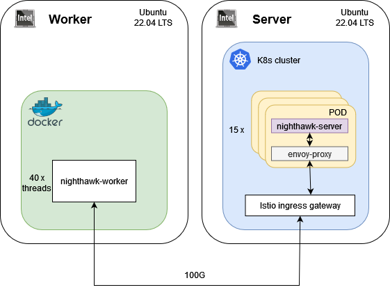

## Prerequisites
* Git [latest stable version]
* Docker [latest stable version]

## Cluster



Two machines are needed:
* The k8s cluster is one node setup (1 machine with Ubuntu 22.04). The cluster is created by means of [Intel's BMRA - Intel Container Experience Kits Setup Scripts](https://github.com/intel/container-experience-kits) and contains Istio service mesh and nighthawk infrastructure (including nighthawk server). Istio service mesh and nighthawk tool manifests are in *config* directory. Refer to instructions in the entitled file: `CLUSTER` in this package.

* On the other machine we can run the bash script `benchmark.sh` that include benchmark with nighthawk_client. It installs all necessary tools (if they don't exist), checks ssh connection, retrieves node port and IP address for given server configurations and runs nighthawk benchmark.


## Information about the script `benchmark.sh`

The script automatically installs packages/tools (sshpass on the local machine, jq, git, perf, flamegraph, sysstat on the remote machine) that are unavailable on the machine. It provides logs that document all subsequent steps of the benchmark, information about measurement and location where the results are stored.

By means of bash script you can run benchmark setup with:
1) [Nighthawk](https://github.com/envoyproxy/nighthawk) for HTTP/1.1 or HTTP/2 + [perf](https://perf.wiki.kernel.org/index.php/Main_Page) tool

2) [Nighthawk](https://github.com/envoyproxy/nighthawk) for HTTP/1.1 or HTTP/2

3) [Flamegraph](https://github.com/brendangregg/FlameGraph) postprocessing

Tools:

* [Nighthawk](https://github.com/envoyproxy/nighthawk) is a workload generator and tool that enables performance characterization. Nighthawk is run in docker container. It collects the following KPIs: RPS (Requests per Second), latency, response body and header size.

* [perf](https://perf.wiki.kernel.org/index.php/Main_Page) is a profiler tool. It collects measurable standard events, CPU functions and CPU counter statistics.

* [Flamegraph](https://github.com/brendangregg/FlameGraph) is used for visualization of stack traces of profiled software.


## Nighthawk - worker

Before you run `benchmark.sh`, create a docker container based on nighthawk image.

```docker
FROM envoyproxy/nighthawk-dev:2256da19d138866ca82adff2de7c5a5071cb430e
```
The next step is to install bash and util-linux inside container because 'taskset' is required.

```docker
RUN apk add bash util-linux
```

The last step required before running the script is to run the container.

## Run the benchmark script

The user that is used to connect to the remote device should have root privileges

```bash
$ chmod +x benchmark.sh
$ ./benchmark.sh --help # Command prints information how to use this script
```
Output:
```
The general script's help msg
Usage: ./benchmark.sh <IP> [-u|--user <arg>] [-P|--pass <arg>] [-p|--port <arg>] [-r|--rps <arg>] [--max-rps <arg>] [--step-rps <arg>] [-a|--arch <arg>] [-N|--nh-cpu <arg>] [--protocol <arg>] [-d|--duration <arg>] [-k|--kill-delay <arg>] [--mar <arg>] [--mcs <arg>] [--con <arg>] [--rbs <arg>] [--mpr <arg>] [--mrpc <arg>] [-c|--container-name <arg>] [-e|--eth-dev <arg>] [--(no-)perf] [--(no-)mpstat] [--note <arg>] [-h|--help]
      <IP>: IP of the server machine.
      -u, --user: The user we are connecting to via ssh. (default: 'root')
      -P, --pass: User password for ssh connection. (no default)
      -p, --port: The port on which you connect to the server. (required)
      -r, --rps: Number of requests per second. (required)
      --max-rps: If this parameter is specified, measurements will be performed in a loop, starting from the RPS value specified with --rps and ending with the value specified with --max-rps, with a step equal to --step-rps.
      --step-rps: RPS step in the loop. (default: 10)
      -a, --arch: Server processor architecture type. (required) (possible values: icx or spr)
      -N, --nh-cpu: List or range of threads that Nighthawk will use. (required)
      --protocol: Protocol used. (default: 'http1') (possible values: http1, http2 or https)
      -d, --duration: Nighthawk measurement duration [sec]. (default: 30)
      -k, --kill-delay: Time [sec] after which the Nighthawk process will be killed at the end of the measurement, if it does not kill itself. (default: 30)
      --mar: The maximum allowed number of concurrently active requests. (for HTTP/2 and HTTPS) (default: 500)
      --mcs: Max concurrent streams allowed on one HTTP/2 connection. (for HTTP/2 and HTTPS) (default: 100)
      --con: The maximum allowed number of concurrent connections per event loop. (for HTTP/1) (default: 1000)
      --rbs: Size of the request body to send. NH will send a number of consecutive 'a' characters equal to the number specified here. (default: 400)
      --mpr: Max pending requests. (for HTTPS) (default: 100)
      --mrpc: Max requests per connection. (for HTTPS) (default: 7)
      -c, --container-name: Name of the container with Nighthawk. (default: 'nighthawk')
      -e, --eth-dev: ETH DEV. (no default)
      --perf, --no-perf: Determines whether to use Perf during measurements. If Perf is not on the machine, it will be installed. (off by default)
      --mpstat, --no-mpstat: Determines whether to use mpstat during measurements. If mpstat is not on the machine, it will be installed. (off by default)
      --note: Add a note to be added to the report.
      -h, --help: Prints help
```

### Examples:

```bash
# use case #1 - run benchmark for one node with IP address <example_node_ip>, on port 10000, request per second equals to 100 
# for protocol HTTP/1 and 100 connections [connections are HTTP/1 only], nighthawk measurement lasts 50 seconds.
$ ./benchmark.sh <example_node_ip> --port 10000 --rps 100 --nh-cpu 5-9 -d 50 --protocol http1 --con 100
```
```bash
# use case #2 - run benchmark for one node with IP address <example_node_ip>, on port 10000, request per second equals to 100
# for protocol HTTP/2, max concurrent streams parameter equals to 50 (--mcs) and max active requests equals to 100(--mar) [mcs and mar
# arguments are HTTP/2 only], nighthawk measurement lasts 50 seconds.
$ ./benchmark.sh <example_node_ip> --port 10000 --rps 100 --nh-cpu 5-9 -d 50 --protocol http2 --mcs 50 --mar 100
```
```bash
# use case #3 - run series of benchmarks for one node with IP address <example_node_ip>, on port 10000, request per second equals to 100 
# for protocol HTTP/1 and 100 connections [connections are HTTP/1 only]. Nighthawk measurement lasts 50 seconds.
# Measurements will be performed in a loop, starting from the RPS value specified with --rps and ending with the value specified 
# with --max-rps, with a step equal to --step-rps. 
$ ./benchmark.sh <example_node_ip> --port 10000 --rps 100 --max-rps 200 --step-rps 10 --nh-cpu 5-9 -d 50 --protocol http1 --con 100
```

```bash
# use case #4 - run benchmark for one node with IP address <example_node_ip>, on port 10000, request per second equals to 100 
# for protocol HTTPS, max concurrent streams parameter equals to 50 (--mcs) and max active requests equals to 100(--mar) [mcs and mar arguments are HTTP/2 only] nighthawk measurement lasts 50 seconds.
$ ./benchmark.sh <example_node_ip> --port 10000 --rps 100 --nh-cpu 5-9 -d 50 --protocol https --mcs 50 --mar 100
```

## Example of nighthawk measurement output

```bash
Nighthawk - A layer 7 protocol benchmarking tool.

benchmark_http_client.latency_2xx (1088223 samples)
  min: 0s 000ms 581us | mean: 0s 001ms 951us | max: 0s 155ms 525us | pstdev: 0s 004ms 779us

  Percentile  Count       Value          
  0.5         544165      0s 001ms 446us 
  0.75        816169      0s 001ms 810us 
  0.8         870580      0s 001ms 924us 
  0.9         979424      0s 002ms 283us 
  0.95        1033826     0s 002ms 682us 
  0.990625    1078021     0s 006ms 438us 
  0.99902344  1087161     0s 076ms 644us 

Queueing and connection setup latency (1088278 samples)
  min: 0s 000ms 003us | mean: 0s 000ms 010us | max: 0s 050ms 831us | pstdev: 0s 000ms 450us

  Percentile  Count       Value          
  0.5         545041      0s 000ms 004us 
  0.75        816407      0s 000ms 004us 
  0.8         870793      0s 000ms 004us 
  0.9         979455      0s 000ms 005us 
  0.95        1033871     0s 000ms 006us 
  0.990625    1078077     0s 000ms 009us 
  0.99902344  1087216     0s 000ms 317us 

Request start to response end (1088223 samples)
  min: 0s 000ms 578us | mean: 0s 001ms 951us | max: 0s 155ms 525us | pstdev: 0s 004ms 779us

  Percentile  Count       Value          
  0.5         544166      0s 001ms 446us 
  0.75        816170      0s 001ms 810us 
  0.8         870587      0s 001ms 924us 
  0.9         979411      0s 002ms 282us 
  0.95        1033812     0s 002ms 681us 
  0.990625    1078021     0s 006ms 438us 
  0.99902344  1087161     0s 076ms 644us 

Response body size in bytes (1088223 samples)
  min: 0 | mean: 0 | max: 0 | pstdev: 0

Response header size in bytes (1088223 samples)
  min: 105 | mean: 105.00806268568115 | max: 107 | pstdev: 0.09130084754964064

Initiation to completion (1091945 samples)
  min: 0s 000ms 001us | mean: 0s 001ms 990us | max: 0s 184ms 090us | pstdev: 0s 005ms 003us

  Percentile  Count       Value          
  0.5         546018      0s 001ms 452us 
  0.75        818968      0s 001ms 817us 
  0.8         873583      0s 001ms 931us 
  0.9         982768      0s 002ms 291us 
  0.95        1037358     0s 002ms 694us 
  0.990625    1081709     0s 008ms 741us 
  0.99902344  1090879     0s 078ms 622us 

Counter                                 Value       Per second
benchmark.http_2xx                      1088223     36274.09
benchmark.pool_overflow                 3722        124.07
cluster_manager.cluster_added           40          1.33
default.total_match_count               40          1.33
membership_change                       40          1.33
runtime.load_success                    1           0.03
runtime.override_dir_not_exists         1           0.03
upstream_cx_http1_total                 2310        77.00
upstream_cx_rx_bytes_total              141477764   4715924.07
upstream_cx_total                       2310        77.00
upstream_cx_tx_bytes_total              502784436   16759476.24
upstream_rq_pending_overflow            3722        124.07
upstream_rq_pending_total               2310        77.00
upstream_rq_total                       1088278     36275.92
```

## Example of summary report

The following report is generated by the `benchmark.sh` script:
```bash
Measurement taken on Tue Oct 25 02:23:33 PM UTC 2022.

Information about the remote machine:
OS: Ubuntu 22.04 LTS
Kernel: 5.15.0-50-generic
NIC driver: 1.8.8
NIC firmware: 3.20
Docker version: 20.10.17
Kubernetes version: v1.22.3
Calico version: v3.21.4
Istio version: 
Hyper Threading: Enabled
Turbo Boost: Disabled
Governor: 144x performance
Max cpu freq: 144x 2000 [MHz]
Min cpu freq: 144x 2000 [MHz]
Proc name: Intel(R) Xeon(R) Platinum 8360Y CPU @ 2.40GHz
Architecture: ICX
Socket(s): 2
Core(s) per socket: 36
Stepping: 6
NUMA node(s): 4
Max uncore freq: 2000 [MHz]
Min uncore freq: 2000 [MHz]
Status of Irqbalance: inactive (dead) since Tue 2022-10-25 07:42:33 UTC; 6h ago
Memory for ingress (limits/requests): 4Gi/4Gi
Ingress cpu: 5,22,77,94 (4)
Nighthawk cpu: 79,2,19,81,88,1,91,89,21,3,78,25,85,4,90
Sidecar cpu: 10,75,92,86,93,74,20,18,96,76,7,9,14,6,23


Note:
SNC2, respone and request body size 400b


No.    |    Core/Thread    |    Protocol    |    RPS per worker    |    Requested RPS    |    Achieved RPS    |    P90 latency       |    P99 latency       |    Blocked    |    CPU Ingress [%]    |    Nighthawk Ingress [%]    |    Sidecar Ingress [%]
1      |    2C4T           |    https       |    130               |    5200             |    4777.76         |    1s 388ms 052us    |    1s 572ms 601us    |    false      |                       |                             |    
2      |    2C4T           |    https       |    131               |    5240             |    4721.03         |    1s 535ms 639us    |    1s 800ms 077us    |    false      |                       |                             |    
3      |    2C4T           |    https       |    132               |    5280             |    4736.20         |    1s 388ms 118us    |    1s 523ms 580us    |    false      |                       |                             |    

cryptomp_rsa_queue_sizes_bucket: 2621

```

Copyright (c) Intel Corporation.

Neither the name of Intel Corporation nor the names of its suppliers
  may be used to endorse or promote products derived from this software
  without specific prior written permission.

No reverse engineering, decompilation, or disassembly of this software
  is permitted.

DISCLAIMER.  THIS SOFTWARE IS PROVIDED BY THE COPYRIGHT HOLDERS AND
CONTRIBUTORS "AS IS" AND ANY EXPRESS OR IMPLIED WARRANTIES, INCLUDING,
BUT NOT LIMITED TO, THE IMPLIED WARRANTIES OF MERCHANTABILITY AND
FITNESS FOR A PARTICULAR PURPOSE ARE DISCLAIMED. IN NO EVENT SHALL THE
COPYRIGHT OWNER OR CONTRIBUTORS BE LIABLE FOR ANY DIRECT, INDIRECT,
INCIDENTAL, SPECIAL, EXEMPLARY, OR CONSEQUENTIAL DAMAGES (INCLUDING,
BUT NOT LIMITED TO, PROCUREMENT OF SUBSTITUTE GOODS OR SERVICES; LOSS
OF USE, DATA, OR PROFITS; OR BUSINESS INTERRUPTION) HOWEVER CAUSED AND
ON ANY THEORY OF LIABILITY, WHETHER IN CONTRACT, STRICT LIABILITY, OR
TORT (INCLUDING NEGLIGENCE OR OTHERWISE) ARISING IN ANY WAY OUT OF THE
USE OF THIS SOFTWARE, EVEN IF ADVISED OF THE POSSIBILITY OF SUCH
DAMAGE.

