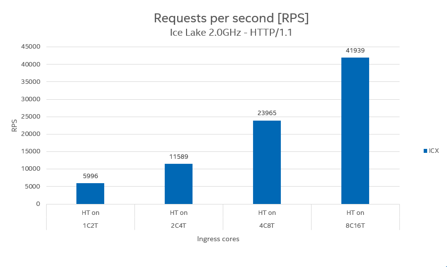
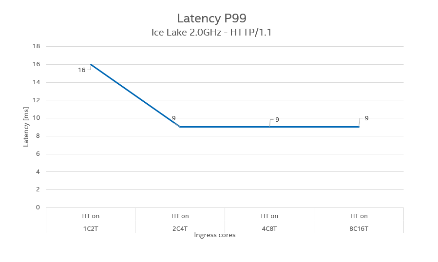
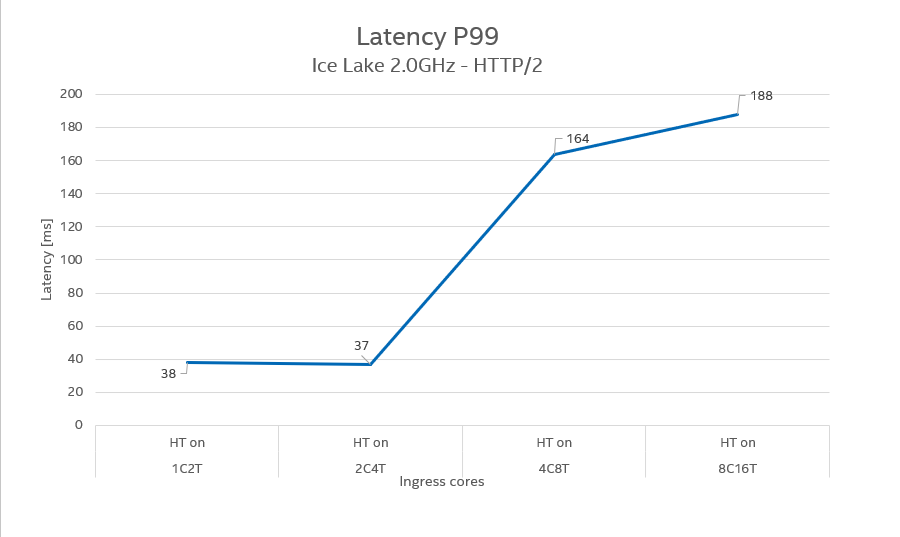
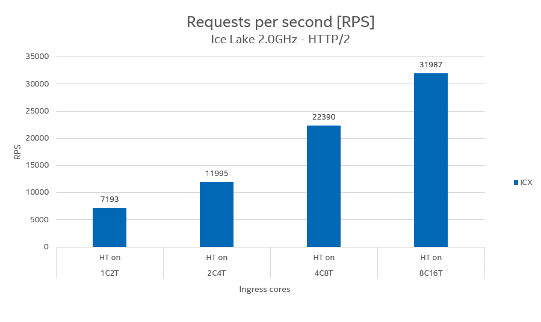
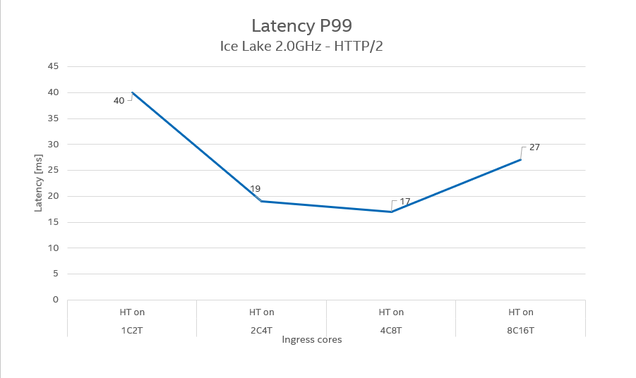

## Experiments

The given methodology and scripts were used to perform system benchmarks in terms of scaling the number of cores assigned to the istio ingress gate.
Below are placed few examples of measurement scenarios that we have performed:

**Max RPS** - means that we tried to increase the requested RPS so as to obtain the highest possible resolved RPS without blocking

**Balanced** - a scenario where we tried to find the maximum number of resolved RPS but additionally obtain a latency P99 below some value, e.g. 50ms

The last measurements were made on the configuration below:
```
OS: Ubuntu 22.04 LTS
Kernel: 5.15
NIC driver: 1.8.8
NIC firmware: 3.20
Docker: 20.10.17
Kubernetes: v1.22.3
Istio: 1.13.4
Calico: 3.21.4
IRQ Balance: disabled
aRFS: enabled
Frequency Governer: performance
c-state: enabled
TurboBoost: disabled
Hyper-threading: enabled
Request body size: 400b
Response body size: 400b
CPU freq: 2.0Ghz
CPU uncore freq: 2.0 GHz
Nighthawk worker was running on 40 threads in each measurement
```

### Example #1
HTTP/1.1, scenario: max RPS/balanced (In case of HTTP/1.1 max rps scenario was also the one with lowest latency)
```
$ ./benchmark.sh <example_node_ip> --port 10000 ---rps <tuned> --nh-cpu 3-22,51-70 -d 30 --protocol http1 --con 1000
```






### Example #2
HTTP/2, scenario: max RPS
```
$ ./benchmark.sh <example_node_ip> --port 10000 ---rps <tuned> --nh-cpu 3-22,51-70 -d 30 --protocol http2 --mar 500 --mcs 100
```




### Example #3
HTTP/2, scenario: balanced
```
$ ./benchmark.sh <example_node_ip> --port 10000 ---rps <tuned> --nh-cpu 3-22,51-70 -d 30 --protocol http2 --mar 500 --mcs 100
```




