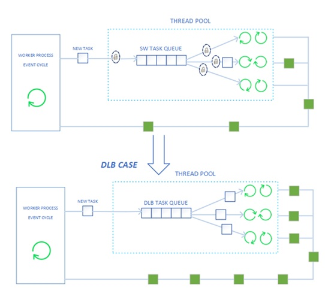
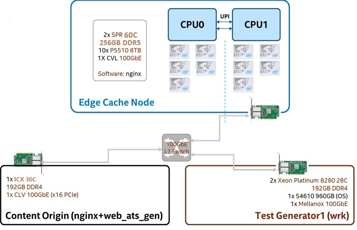

# NGINX AIO Thread with Intel® DLB on 4th Gen Intel® Xeon® Scalable Processors

## Introduction

As one of the most popular CDN framework, NGINX is widely used as CDN cache server. This document is for users who are already familar with [NGINX](https://www.nginx.com/) and Intel [DLB](https://www.intel.com/content/www/us/en/download/686372/intel-dynamic-load-balancer.html) technology. To improve the performance, NGINX introduces the AIO thread module to solve the blocking issue. In this workload, Intel® DLB hardware queue is used to replace the software queue in the AIO thread module to improve the performance.




### Test Setup
The workload is based on 4th Gen Intel® Xeon® Scalable Processor family. Below is a reference system and software configuration for the workload evaluation. Some of the configurations can be changed according to your own system configuration.


#### Reference System Configuration

| Name | Version |
|------------------|-------------|
| BIOS Version | EGSDCRB1.86B.0091.D05.2210161326 |
| OS	CentOS Stream 8 | Kernel	5.15.0-spr.bkc.pc.12.7.15.x86_64|
|Microcode | 0xab000110 |
|IRQ Balance| Disabled |
|QDF/Stepping | Q23U |
|Base Frequency | 1.9GHz |
|Maximum Frequency | 3.5GHz |
|All-core Maximum Frequency | 2.9GHz |
|CPU(s) | 120 |
|Thread(s) per Core | 2 |
|Core(s) per Socket| 60 |
|Socket(s) | 2 (both socket is populated ,tests run 1 socket) |
| NUMA Node(s) | 1 |
| Prefetchers | L2 HW, L2 Adj., DCU HW, DCU IP |
| Turbo	| Enabled |
|PPIN(s)|2921684c17583b38 |
|Power & Perf Policy| Performance |
|TDP | 350 watts |
|Frequency Driver | intel_pstate |
|Frequency Governer| Performance |
|Frequency (MHz) | 2880 |
|Max C-State | 9 |
|Installed Memory |256GB (8x32GB 4800 MT/s [4400 MT/s]) on each socket |
|Huge Pages Size | 2048 kB |
|Transparent Huge Pages | Always |
|Automatic NUMA Balancing |Disabled |
|NIC Summary |Ethernet Controller I225-LM Ethernet Controller E810-C for QSFP, Ethernet Controller E810-C for QSFP |
|Drive Summary | INTEL SSDPF2KX038TZ |


#### Reference Software Configuration

| Name | Version |
|------------------|-------------|
|NGINX version | 1.16.1 |
|Compiler |gcc version 8.5.0 20210514 (Red Hat 8.5.0-15) (GCC) |
|wrk ( client side) | wrk 4.0.0 [epoll] Copyright (C) 2012 Will Glozer |
|DLB Driver	| [RELEASE_VER_7.8.0](https://www.intel.com/content/www/us/en/download/686372/744007/intel-dynamic-load-balancer.html)|
|NIC FW ICE driver version |[NETWORK_DRIVERS_V27.6.1](https://onebkc.intel.com/#/ingredientversion/14017571202) |
|Kernel Parameters | intel_iommu=on,sm_on iommu=on dma_debug=off |

## Test setup
Set the IRQ and CPU performance mode for **origin server, cacher sever and client server**. Run the script in the ***configs folder***.
```
pkill -9 irqbalance
./set_performance_governor.sh
./set_irq_affinity_cpulist.sh 0-119 ens1f1 #change the cpu cores and network interface based on your environment.
```
### Content Server Setup

1. Download the [NGINX 1.16.1](http://nginx.org/en/download.html) version source code
2. Install the dependency library, take Ubuntu as example,other OS please install corresponding tools and library.
    ```
    apt-get install -y make gcc libpcre3-dev zlib1g-dev libxml2 libxslt-dev
    ```
3. Build the NGINX with the command below
    ```
    ## set your prefix path
    mkdir -p $PREFIX/var/www/tmp
    ./configure \
        --prefix=$PREFIX \
        --sbin-path=$PREFIX/sbin/nginx \
        --modules-path=$PREFIX/lib64/nginx/modules \
        --conf-path=$PREFIX/etc/nginx/nginx.conf \
        --error-log-path=$PREFIX/var/www/log/error.log \
        --pid-path=$PREFIX/var/www/nginx.pid \
        --lock-path=$PREFIX/var/www/nginx.lock \
        --http-log-path=$PREFIX/var/www/log/access.log \
        --http-client-body-temp-path=$PREFIX/var/www/tmp/client_body \
        --http-proxy-temp-path=$PREFIX/var/www/tmp/proxy \
        --http-fastcgi-temp-path=$PREFIX/var/www/tmp/fastcgi \
        --http-uwsgi-temp-path=$PREFIX/var/www/tmp/uwsgi \
        --http-scgi-temp-path=$PREFIX/var/www/tmp/scgi \
        --user=nobody --group=nobody \
        --with-select_module --with-poll_module --with-threads \
        --with-pcre
    
    make -j`nproc`

    make install
    ```
4. Copy the ***nginx.conf*** in the origin folder to replace the ***$PREFIX/etc/nginx/nginx.conf*** and change the **server IP** address in the configuration according to your environment.
5. Copy the ***bin*** folder in the ***origin*** folder to ***$PREFIX*** folder.
6. Start the content generator and origin server
    ```
    cd $PREFIX
    ##start 10K, 100K, 1M object generator
    ./bin/http_obj_gen_10k.py --host localhost --port 8888 --obj-dist fixed > /dev/null 2> /dev/null
    ./bin/http_obj_gen_100k.py --host localhost --port 8888 --obj-dist fixed > /dev/null 2> /dev/null
    ./bin/http_obj_gen.py --host localhost --port 8888 --obj-dist fixed > /dev/null 2> /dev/null
    ##start origin server
    ${PWD}/sbin/nginx -c ${PWD}/etc/nginx/nginx.conf
    ```
### Cache Server Setup
***Note: For none dlb case, please ignore the the dlb related opereration in the below steps***
1. mount the NVME disk
    ```
    ##modify the nvme disk name according to your environment
    mount -o rw,noatime,seclabel,discard /dev/nvme1n1 /cdn/cache1
    mount -o rw,noatime,seclabel,discard /dev/nvme2n1 /cdn/cache2
    mount -o rw,noatime,seclabel,discard /dev/nvme3n1 /cdn/cache3 
    mount -o rw,noatime,seclabel,discard /dev/nvme4n1 /cdn/cache4 
    mount -o rw,noatime,seclabel,discard /dev/nvme5n1 /cdn/cache5

    ```
2. Download the [NGINX 1.16.1](http://nginx.org/en/download.html) version source code and apply the patches in the ***patches folder***. The patches relies on DLB library, please compile the DLB first, refer the README in the [DLB 7.8.0 package](https://www.intel.com/content/www/us/en/download/686372/intel-dynamic-load-balancer.html).
3. Install the dependency library, take Ubuntu as example,other OS please install corresponding tools and library.
    ```
    apt-get install -y make gcc libpcre3-dev zlib1g-dev libxml2 libxslt-dev
    ```
4. Build the NGINX
    ```
    ##set the DLB library path
    export LIBDLB_LOCAL_PATH=<libdlb path>
    ##set your prefix path
    mkdir -p $PREFIX/var/www/tmp
    ./configure \
      --prefix=$PREFIX \
      --sbin-path=$PREFIX/sbin/nginx \
      --modules-path=$PREFIX/lib64/nginx/modules \
      --conf-path=$PREFIX/etc/nginx/nginx.conf \
      --error-log-path=$PREFIX/var/www/log/error.log \
      --pid-path=$PREFIX/var/www/nginx.pid \
      --lock-path=$PREFIX/var/www/nginx.lock \
      --http-log-path=$PREFIX/var/www/log/access.log \
      --http-client-body-temp-path=$PREFIX/var/www/tmp/client_body \
      --http-proxy-temp-path=$PREFIX/var/www/tmp/proxy \
      --http-fastcgi-temp-path=$PREFIX/var/www/tmp/fastcgi \
      --http-uwsgi-temp-path=$PREFIX/var/www/tmp/uwsgi \
      --http-scgi-temp-path=$PREFIX/var/www/tmp/scgi \
      --user=nobody --group=nobody \
      --with-select_module \
      --with-poll_module \
      --with-threads \
      --with-file-aio \
      --with-pcre
    
    make -j`nproc`

    make install

    ```
5. Modify the IP address in the ***cache-server/nginx.conf*** according to your environment setup. Then, copy the ***nginx.conf*** to replace ***$PREFIX/etc/nginx/nginx.conf***.
6. Modify the libdlb path and nginx install path in the ***start_dlb_nginx.sh*** script in the **cache server** folder. For the none dlb case, please  use the ***start_nginx.sh***.
7. Then run the ***start_dlb_ngxin.sh*** or ***start_nginx.sh*** (none dlb case) to boot the nginx.

    ***Note: Before each interation test, please run the clean page cache script clr_drop_cache.sh in the cache-server folder***

### Client Server Setup
1. Download the [wrk 4.0.0 version](https://github.com/wg/wrk) and compile it refer to README.
2. Copy the files in ***wrk-client folder*** into your wrk folder.
    ```
    copy -R wrk-client <your wrk folder path>
    ```
3. Modify the IP address in the ***wrk1mb.sh***, ***wrk100kb.sh*** and ***wrk10kb.sh***, then run the ***run_mix.sh***.
4. Finally, you can see the latency,RPS and bandwidth information in the log file such as below:
    ```
    connection delay time is 1628664 ns
    Running 5m test @ http://192.168.100.1:8082
    50 threads and 30700 connections(ramping 30700 per sec)
    Thread Stats   Avg      Stdev     Max   +/- Stdev
        Latency     3.52s   544.01ms   9.18s    72.66%
        Connect   512.39ms  324.55ms   1.12s    57.46%
        Delay     558.98ms  214.80ms   2.00s    68.72%
        Req/Sec   157.87     80.47     1.15k    70.67%
    Latency Distribution
    50.00%    3.51s
    75.00%    3.84s
    90.00%    4.19s
    99.00%    4.96s
    99.90%    5.70s
    99.99%    7.13s
    Connect Distribution
    50.00%  508.61ms
    75.00%  792.06ms
    90.00%  965.97ms
    99.00%    1.09s
    99.90%    1.11s
    99.99%    1.11s
    Delay Distribution
    50.00%  541.15ms
    75.00%  692.84ms
    90.00%  842.74ms
    99.00%    1.13s
    99.90%    1.41s
    99.99%    1.73s
    2324796 requests in 5.00m, 2.23TB read
    Socket errors: connect 0, read 0, write 0, pconn 33, nodata 0, timeout 0, connect_timeout 0, delay_timeout 265
    Requests/sec:   7746.40
    Transfer/sec:      7.60GB
    ```

Copyright (c) Intel Corporation.

Neither the name of Intel Corporation nor the names of its suppliers
  may be used to endorse or promote products derived from this software
  without specific prior written permission.

No reverse engineering, decompilation, or disassembly of this software
  is permitted.

DISCLAIMER.  THIS SOFTWARE IS PROVIDED BY THE COPYRIGHT HOLDERS AND
CONTRIBUTORS "AS IS" AND ANY EXPRESS OR IMPLIED WARRANTIES, INCLUDING,
BUT NOT LIMITED TO, THE IMPLIED WARRANTIES OF MERCHANTABILITY AND
FITNESS FOR A PARTICULAR PURPOSE ARE DISCLAIMED. IN NO EVENT SHALL THE
COPYRIGHT OWNER OR CONTRIBUTORS BE LIABLE FOR ANY DIRECT, INDIRECT,
INCIDENTAL, SPECIAL, EXEMPLARY, OR CONSEQUENTIAL DAMAGES (INCLUDING,
BUT NOT LIMITED TO, PROCUREMENT OF SUBSTITUTE GOODS OR SERVICES; LOSS
OF USE, DATA, OR PROFITS; OR BUSINESS INTERRUPTION) HOWEVER CAUSED AND
ON ANY THEORY OF LIABILITY, WHETHER IN CONTRACT, STRICT LIABILITY, OR
TORT (INCLUDING NEGLIGENCE OR OTHERWISE) ARISING IN ANY WAY OUT OF THE
USE OF THIS SOFTWARE, EVEN IF ADVISED OF THE POSSIBILITY OF SUCH
DAMAGE.
