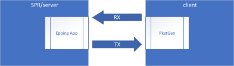
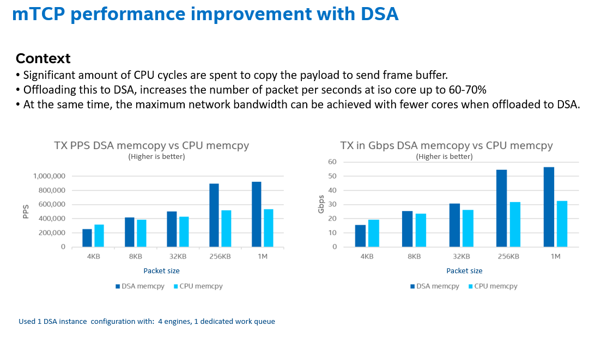

## Introduction

Intel Vector Data Streaming Library is a zoo of solutions based on accelerators in the die of Intel 4th Xeon Scalable processor,code-named [“Sapphire Rapids”](https://www.intel.com/content/www/us/en/newsroom/opinion/updates-next-gen-data-center-platform-sapphire-rapids.html?wapkw=Intel%20Sapphire%20Rapids%20Demos%20At%20Innovation%202022). Intel provide a boundle of powerful accelerators for different scenarios as below table.
Using this libary, users can achieve up to a 1.7x performance increase

Hardware and software being used in order to achieve the 1.7X performance claimed

## Hardware Configurations

| Name | Value |
|--------------| -------------------|
|System | [Intel Corporation EAGLESTREAM](https://designintools.intel.com/intel-platforms/data-center-comms-and-storage/eagle-stream-platform-tools.html) |
|  Baseboard | [Intel Corporation EAGLESTREAM](https://designintools.intel.com/intel-platforms/data-center-comms-and-storage/eagle-stream-platform-tools.html) |
|  Chassis | Intel Corporation Rack Mount Chassis|
|  CPU Model | [Intel(R) Xeon(R) Platinum 8454H](https://ark.intel.com/content/www/us/en/ark/products/231738/intel-xeon-platinum-8454h-processor-82-5m-cache-2-10-ghz.html)|
|  Silicon Stepping, QDF | E3-Q17D|
|  Microarchitecture | SPR|
|  Sockets | 2|
|  Cores per Socket | 32|
|  Hyperthreading | Enabled|
|  CPUs | 128|
|  Intel Turbo Boost | Enabled|
|  Base Frequency | 2.1GHz|
|  All-core Maximum Frequency | 3.4GHz|
|  Maximum Frequency | 2.7GHz|
|  NUMA Nodes | 2|
|  Prefetchers | L2 HW, L2 Adj., DCU HW, DCU IP|
|  PPINs | 9f4a1e18ab770c59,8be507153d00daa1|
|  Accelerators | QAT:8, DSA:8, IAA:0, DLB:8|
|  Installed Memory | 256GB (16x16GB 4800 MT/s \[4800 MT/s\])|
 
## System Configurations

| Name | Value |
|--------------| -------------------|
|  Huge page size | 2048 kB|
|  Transparent Huge Pages | always|
|  Automatic NUMA Balancing | Enabled|
|  NIC | 1x Ethernet Controller I225-LM, 2x Ethernet Controller E810-C for QSFP|
|  Disk | 1x 894.3G INTEL SSDSC2KG96|
|  BIOS | EGSDCRB1.86B.0080.D21.2205151325|
|  Microcode | 0x890000c0|
|  OS | CentOS Stream 8|
|  Kernel | 5.15.0-spr.bkc.pc.7.7.4.x86_64|
|  TDP | 270W|
|  Power & Perf Policy | Performance|
|  Frequency Governor | intel_pstate|
|  Frequency Driver | performance|
|  Max C-State | 9|


## Special BIOS Configurations


| Configuration Item | Recommended Value |
|---------------------|------------------|
| EDKII Menu \> Socket Configuration \> Uncore Configuration \> Uncore Dfx Configuration \> Cache entries for non-atomics | 120 |
| EDKII Menu \> Socket Configuration \> Uncore Configuration \> Uncore Dfx Configuration \> Cache entries for atomics | 8 |
| EDKII Menu \> Socket Configuration \> Uncore Configuration \> Uncore Dfx Configuration \> CTAG entry avail mask | 255 |
| EDKII Menu-\> \"Socket Configuration\" -\> \"IIO Configuration\" -\> \"Intel VT for directed IO (VT -d)\"  Intel VT for directed IO | Enable |
| EDKII Menu-\> \"Socket Configuration\" -\> \"IIO Configuration\" -\> \"PCI ENQCMD/ENQCMDS\" | Enable |

## Software Configurations

|| **Config1 (baseline)** | **Config2 (DSA acceleration)** |
|-----------------|-----------------------------|-----------------------------------|
| Workload & version | mTCP stack -Master branch | mTCP stack -Master branch With DSA --idxd |
| Compiler | gcc (GCC) 8.5.0 20210514 (Red Hat 8.5.0-13) | gcc (GCC) 8.5.0 20210514 (Red Hat 8.5.0-13) |
| Libraries | ldd (GNU libc) 2.28 GNU ld version 2.36.1-3.el8 Python 3.6.8 | ldd (GNU libc) 2.28 GNU ld version 2.36.1-3.el8 Python 3.6.8 |
| Kernel | version: 5.13.0 | version: 5.13.0 |
| OS | CentOS Stream 8 | CentOS Stream 8 |
| DPDK | 22.03 | 22.03 |
| Accel config | NA | Version: 3.4.4 |
| Client-Packetgen | 21.050 | 21.050 |



Setup diagram:

**Linux Kernel Settings**

Typically, CentOS 8 Stream OS is used for the PoC environment, because
DSA is enabled.

Before compiling the kernel, check DSA related configurations are
supported:

```
CONFIG_INTEL_IDXD=m

CONFIG_INTEL_IDXD_BUS=y

CONFIG_INTEL_IDXD_COMPAT=y

CONFIG_INTEL_IDXD_PERFMON=y

CONFIG_INTEL_IDXD_SVM=y

CONFIG_VFIO_MDEV_IDXD=m

CONFIG_IRQ_REMAP=y

CONFIG_INTEL_IOMMU=y

CONFIG_INTEL_IOMMU_SVM=y

CONFIG_IMS_MSI=y

CONFIG_IMS_MSI_ARRAY=y

CONFIG_IRQ_REMAP=y

CONFIG_PCI_ATS=y CONFIG_PCI_PRI=y

CONFIG_PCI_PASID=y

CONFIG_DMA_ENGINE=m

CONFIG_DMATEST=m
```

## Software steps:

**Download Source Code**
```
git clone https://github.com/intel/Intel-Vector-Data-Streaming-Library.git
```

**DSA Configuration**

**accel-config** is a user-space tool for controlling and configuring DSA hardware devices.

**How to install accel-config tool**, please refer to [*https://github.com/intel/idxd-config*](https://github.com/intel/idxd-config).

These instructions were written using the tag >= \*\* 6bd68e68 \*\*. Before compiling & installing, run:

```
git checkout 6bd68e68

#Below is the command to enable 1 DSA device, 4 engine and 1dedicated work queue:

cd Intel-Vector-Data-Streaming-Library/DSAZoo/dsa_userlib/config_dsa

#Configure with script tool
./setup_dsa.sh -d dsa0 -w 1 -m d -e 4
```

**Build PoC**
```
#Enter mtcp directory

cd Intel-Vector-Data-Streaming-Library/DSAZoo

cd example\_mtcp

#Run script pre_dpdk2203.sh to git clone dpdk v22.03, and then build
and install it

./pre_dpdk2203.sh ~dpdk2203

#Run script pre_compile.sh to prepare the environment before you
building this project:

./pre_compile.sh

#Set env

export RTE_SDK=`echo $PWD`/dpdk

export
PKG_CONFIG_PATH=${PKG_CONFIG_PATH}:~/dpdk2203/lib64/pkgconfig

export LD_LIBRARY_PATH=${LD_LIBRARY_PATH}:~/dpdk2203/lib64 
export LD_LIBRARY_PATH=${LD_LIBRARY_PATH}:./

#Run make command to build the project.

make
```
**DPDK environment configuration**

```
Build and install igb_uio.ko

git clone http://dpdk.org/git/dpdk-kmods

cd dpdk-kmods/linux/igb_uio/ make

modprobe uio

insmod igb_uio.ko

#Setup hugepage mappings:

mkdir -p /mnt/huge

mount -t hugetlbfs nodev /mnt/huge

#Set 4x1G hugepages each numa node

echo 4 > /sys/devices/system/node/node0/hugepages/hugepages-1048576kB/nr_hugepages

echo 4 > /sys/devices/system/node/node1/hugepages/hugepages-1048576kB/nr_hugepages

#Bind nic to uio

#Down nic interface in kernel driver:

ifconfig ensXX down

#Bind nic to uio, RTE_SDK is dpdk22.03 install path, PCI_PATH is nic PCI Function Address ${RTE_SDK}/bin/dpdk-devbind.py -b igb_uio $PCI_PATH
```

**Packet receiver server setup steps**

For details, please refer to
https://pktgen-dpdk.readthedocs.io/en/latest/getting\_started.html

1\. Build and install DPDK to your packet receiver machine

2\. Clone pktgen-dpdk repo and build it

git clone http://dpdk.org/git/apps/pktgen-dpdk

Use make command to build it. Please refer
tohttps://pktgen-dpdk.readthedocs.io/en/latest/getting\_started.ht
dpdk-and-pktgen

3\. Set DPDK, allocate huge pages, bind NIC to DPDK.

4\. Launch pktgen-dpdk tool, like

./usr/local/bin/pktgen -c 0x3 -n 2 \-- -P -m \"1.0\"

5\. Enter the following command in pktgen cmdline to send packets:

\#This mac address is SPR NIC mac address
```
set 0 dst mac 40:a6:b7:67:19:f0

set 0 proto tcp

set 0 size 5000

set 0 rate 0.01

start 0

#If you want pause, you can enter:

stop 0
```
**Performance Measurement**

You can observe PPS and bandwidth from Pkts/s and MBits/s in PKTGEN
Console.

**mTCP** **APP Configuration File**
```
cd Intel-Vector-Data-Streaming-Library/DSAZoo/example\_mtcp/apps/example
```
```
vim epping.conf
```

\#Modify port to your NIC PCIe number, for example:

port = 0000:29:00.0 (your NIC PCIe number)

**Implementation and performance of CPU & DSA async mode Benchmark with
CPU**
```
cd Intel-Vector-Data-Streaming-Library/DSAZoo/example\_mtcp/apps/example

# 4K

./epping -f epping.conf -l 4k -n 32768

# 8K

./epping -f epping.conf -l 8k -n 16384

# 32K

./epping -f epping.conf -l 32k -n 4096

# 256K

./epping -f epping.conf -l 256k -n 512

# 1M

./epping -f epping.conf -l 1m -n 128

# 2M

./epping -f epping.conf -l 2m -n 64
```

**Benchmark with DSA async mode**
```

cd Intel-Vector-Data-Streaming-Library/DSAZoo/example\_mtcp/apps/example

# 4K

./epping -f epping.conf -l 4k -n 32768 -d

# 8K

./epping -f epping.conf -l 8k -n 16384 -d

# 32K

./epping -f epping.conf -l 32k -n 4096 -d

# 256K

./epping -f epping.conf -l 256k -n 512 -d
```

**Implementation and performance of CPU & DSA unpacking**

**Benchmark with CPU unpacking**

```
# unpacking to 64 Bytes packet

./epping -f epping.conf -d -m 64

# unpacking to 128 Bytes packet

./epping -f epping.conf -d -m 128

# unpacking to 256 Bytes packet

./epping -f epping.conf -d -m 256

# unpacking to 512 Bytes packet

./epping -f epping.conf -d -m 512

# unpacking to 1460 Bytes packet

./epping -f epping.conf -d -m 1460

# unpacking to 4096 Bytes packet

./epping -f epping.conf -d -m 4096

# unpacking to 8192 Bytes packet

./epping -f epping.conf -d -m 8192

**Benchmark with DSA unpacking**

# unpacking to 64 Bytes packet

./epping -f epping.conf -du -m 64

# unpacking to 128 Bytes packet

./epping -f epping.conf -du -m 128

# unpacking to 256 Bytes packet

./epping -f epping.conf -du -m 256

# unpacking to 512 Bytes packet

./epping -f epping.conf -du -m 512

# unpacking to 1024 Bytes packet

./epping -f epping.conf -du -m 1024
```

## Performance Claim:

Throughput up to 1.7x improvement when using DSA accelerator to offload CPU vs software running on cores on mTCP workload with sending data size 256KB (or bigger).



Test by Intel as of 22nd Jun 2022.


Performance varies by use, configuration and other factors. Learn more
at
[www.Intel.com/PerformanceIndex](http://www.Intel.com/PerformanceIndex).

Performance results are based on testing as of dates shown in configurations and may not reflect all publicly available updates. See backup for configuration details. No product or component can be absolutely secure.

Intel disclaims all express and implied warranties, including without limitation, the implied warranties of merchantability, fitness for a particular purpose, and non-infringement, as well as any warranty arising from course of performance, course of dealing, or usage in trade.

Intel technologies may require enabled hardware, software or service activation.

Intel does not control or audit third-party data. You should consult other sources to evaluate accuracy.

The products described may contain design defects or errors known as errata which may cause the product to deviate from published specifications. Current characterized errata are available on request.

© Intel Corporation. Intel, the Intel logo, and other Intel marks are trademarks of Intel Corporation or its subsidiaries. Other names and brands may be claimed as the property of others.
