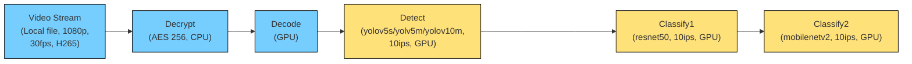
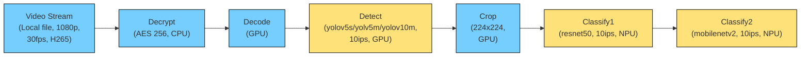

>
> **Note: The Workload Services Framework is a benchmarking framework and is not intended to be used for the deployment of workloads in production environments. It is recommended that users consider any adjustments which may be necessary for the deployment of these workloads in a production environment including those necessary for implementing software best practices for workload scalability and security.**
>
### Introduction

This is a General Video Analytics workload that focuses on the analytics capability of an EPU (irrespective of HW acceleration available) and will stress the system in compute/memory BW/media/cache/Power/Icc etc. to understand the true limitations of a system under a specific configuration. It mainly includes decode, object detection, object tracking, and object classification stages. The workload takes advantage of DLStreamer. 

The pipeline for all GPU testcases. 



The pipeline for GPU+NPU testcases.



### Test Case

This workload provides several tests cases with the following configuration parameters. 
- `TestName`: It is a test case and contains a specific video analytics pipeline.
- `G_NumofVaStream`: Specify the number of VA streams, default is `1`.
- `SCALING_GOVERNOR`:Specify the"scaling_governor" value which enables setting a static frequency to the CPU. Default value is `powersave` to measure workload with platform default setting after booting.
- `G_CPU_Bind`: Specify CPU cores for launching the VA process. This accepts cpu numbers as shown in the processor fields of /proc/cpuinfo, or relative cpus as in relative to the current cpuset. Refer to the [--physcpubind](https://linux.die.net/man/8/numactl#:~:text=%2D%2D-,physcpubind,-%3Dcpus%2C%20%2DC%20cpus) parameter of numactl for more details. Default is `6-13`, which are the E cores on ARL.

The following are all the testcases supported by platform ARL. 

<table>
    <thead>
        <tr>
            <th>No.</th>
            <th>Testcases</th>
            <th>Platform</th>
            <th>OD Model</th>
            <th>OC Model</th>
            <th>OD inference_device</th>
            <th> OC inference device </th>
            <th>OD inference batch size</th>
            <th>OC inference batch size</th>
        </tr>
    </thead>
    <tbody>
        <tr>
            <td>1</td>
            <td>test_general-video-analytics-cnn-generic_arl-light-igpu-bs1</td>
            <td>ARL</td>
            <td>yolov5s</td>
            <td>Resnet50 and Mobilenet-v2</td>
            <td>iGPU</td>
            <td>iGPU</td>
            <td>1</td>
            <td>1</td>
        </tr>
        <tr>
            <td>2</td>
            <td>test_general-video-analytics-cnn-generic_arl-light-igpu-bs8</td>
            <td>ARL</td>
            <td>yolov5s</td>
            <td>Resnet50 and Mobilenet-v2</td>
            <td>iGPU</td>
            <td>iGPU</td>
            <td>8</td>
            <td>8</td>
        </tr>
        <tr>
            <td>3</td>
            <td>test_general-video-analytics-cnn-generic_arl-medium-igpu-bs1</td>
            <td>ARL</td>
            <td>yolov5m</td>
            <td>Resnet50 and Mobilenet-v2</td>
            <td>iGPU</td>
            <td>iGPU</td>
            <td>1</td>
            <td>1</td>
        </tr>
        <tr>
            <td>4</td>
            <td>test_general-video-analytics-cnn-generic_arl-medium-igpu-bs8</td>
            <td>ARL</td>
            <td>yolov5m</td>
            <td>Resnet50 and Mobilenet-v2</td>
            <td>iGPU</td>
            <td>iGPU</td>
            <td>8</td>
            <td>8</td>
        </tr>
        <tr>
            <td>5</td>
            <td>test_general-video-analytics-cnn-generic_arl-heavy-igpu-bs1</td>
            <td>ARL</td>
            <td>yolov10m</td>
            <td>Resnet50 and Mobilenet-v2</td>
            <td>iGPU</td>
            <td>iGPU</td>
            <td>1</td>
            <td>1</td>
        </tr>
        <tr>
            <td>6</td>
            <td>test_general-video-analytics-cnn-generic_arl-heavy-igpu-bs8</td>
            <td>ARL</td>
            <td>yolov10m</td>
            <td>Resnet50 and Mobilenet-v2</td>
            <td>iGPU</td>
            <td>iGPU</td>
            <td>8</td>
            <td>8</td>
        </tr>
        <tr>
            <td>7</td>
            <td>test_general-video-analytics-cnn-generic_arl-light-igpu-bs1-ivpu-bs1</td>
            <td>ARL</td>
            <td>yolov5s</td>
            <td>Resnet50 and Mobilenet-v2</td>
            <td>iGPU</td>
            <td>NPU</td>
            <td>1</td>
            <td>1</td>
        </tr>
        <tr>
            <td>8</td>
            <td>test_general-video-analytics-cnn-generic_arl-light-igpu-bs8-ivpu-bs1</td>
            <td>ARL</td>
            <td>yolov5s</td>
            <td>Resnet50 and Mobilenet-v2</td>
            <td>iGPU</td>
            <td>NPU</td>
            <td>8</td>
            <td>1</td>
        </tr>
        <tr>
            <td>9</td>
            <td>test_general-video-analytics-cnn-generic_arl-medium-igpu-bs1-ivpu-bs1</td>
            <td>ARL</td>
            <td>yolov5m</td>
            <td>Resnet50 and Mobilenet-v2</td>
            <td>iGPU</td>
            <td>NPU</td>
            <td>1</td>
            <td>1</td>
        </tr>
        <tr>
            <td>10</td>
            <td>test_general-video-analytics-cnn-generic_arl-medium-igpu-bs8-ivpu-bs1</td>
            <td>ARL</td>
            <td>yolov5m</td>
            <td>Resnet50 and Mobilenet-v2</td>
            <td>iGPU</td>
            <td>NPU</td>
            <td>8</td>
            <td>1</td>
        </tr>
        <tr>
            <td>11</td>
            <td>test_general-video-analytics-cnn-generic_arl-heavy-igpu-bs1-ivpu-bs1</td>
            <td>ARL</td>
            <td>yolov10m</td>
            <td>Resnet50 and Mobilenet-v2</td>
            <td>iGPU</td>
            <td>NPU</td>
            <td>1</td>
            <td>1</td>
        </tr>
        <tr>
            <td>12</td>
            <td>test_general-video-analytics-cnn-generic_arl-heavy-igpu-bs8-ivpu-bs1</td>
            <td>ARL</td>
            <td>yolov10m</td>
            <td>Resnet50 and Mobilenet-v2</td>
            <td>iGPU</td>
            <td>NPU</td>
            <td>8</td>
            <td>1</td>
        </tr>
        <tr>
            <td>13</td>
            <td>test_general-video-analytics-cnn-generic_arl-light-igpu-bs8_pkm</td>
            <td>ARL</td>
            <td>yolov5s</td>
            <td>Resnet50 and Mobilenet-v2</td>
            <td>iGPU</td>
            <td>iGPU</td>
            <td>8</td>
            <td>8</td>
        </tr>
        <tr>
            <td>14</td>
            <td>test_general-video-analytics-cnn-generic_arl-light-igpu-bs1_gated</td>
            <td>ARL</td>
            <td>yolov5s</td>
            <td>Resnet50 and Mobilenet-v2</td>
            <td>iGPU</td>
            <td>iGPU</td>
            <td>1</td>
            <td>1</td>
        </tr>
    </tbody>
</table>

### Environment Setup for Host

#### Hardware: 

* Arrow Lake - U/H CRB

#### Software:

1. Download and install [BIOS](https://www.intel.com/content/www/us/en/secure/content-details/830743/arrow-lake-u-h-for-edge-platforms-uefi-reference-bios-ifwi-4404-55-pv.html?wapkw=830743&DocID=830743).
2. Install [Ubuntu 24.04 OS](https://releases.ubuntu.com/24.04.2/ubuntu-24.04.2-desktop-amd64.iso)
3. Install [kernel](https://edc.intel.com/content/www/us/en/secure/design/confidential/products/platforms/ubuntu-with-kernel-overlay-on-arrow-lake-u-h-for-edge-platforms/introduction/) in OS.
    * Get the latest apt from Ubuntu* archive before setting up PPA from 01.org
        
        ` sudo apt update `
        
        ` sudo apt upgrade `
    * Create a file at /etc/apt/sources.list.d/intel-arl.list with the content to set PPA from 01.org
        
        ` sudo vi /etc/apt/sources.list.d/intel-arl.list `

    * Add the following content, and then save and exit. 

        ``` 
          deb https://download.01.org/intel-linux-overlay/ubuntu noble main non-free multimedia kernels 
          deb-src https://download.01.org/intel-linux-overlay/ubuntu noble main non-free multimedia kernels
        ``` 

    * Download the GPG key to /etc/apt/trusted.gpg.d and rename it to arl.gpg
        
        ` sudo wget https://download.01.org/intel-linux-overlay/ubuntu/E6FA98203588250569758E97D176E3162086EE4C.gpg -O /etc/apt/trusted.gpg.d/arl.gpg ` 

    * Set the preferred list.

        ` sudo vi /etc/apt/preferences.d/intel-arl `

    * Add the following content, and then save and exit.
        ```
            Package: *
            Pin: release o=intel-iot-linux-overlay-noble
            Pin-Priority: 2000
        ```
    * Install kernel, download the package information from all configured sources 
        ```
            sudo apt update
            apt-get install linux-headers-6.11-intel linux-image-6.11-intel vim m4 gawk cmake docker.io docker-buildx
        ```
4. Install [NPU firmware](https://github.com/intel/linux-npu-driver/releases)

    ```
        wget https://github.com/intel/linux-npu-driver/releases/download/v1.17.0/intel-fw-npu_1.17.0.20250508-14912879441_ubuntu24.04_amd64.deb
        sudo dpkg -i *.deb 
    ```

5. Reboot the machine
    
    ` sudo reboot `

#### Required dataset:

* [COCO val2017 datasets](http://images.cocodataset.org)
    * Make sure to download [val2017.zip](http://images.cocodataset.org/zips/val2017.zip) and place it in the `datasets` directory before building the image using the `make` command

### Customize Test Configuration

There are two ways for you to customize your test parameters.

Specify a global test configuration file to overwrite any configuration parameter of a test case and use the ctest.sh to set the parameters.

Refer to [`ctest.md`](../../doc/user-guide/executing-workload/ctest.md#Customize%20Configurations) to customize test parameters.

Run customized test cases for ARL platform:
```
cd build
cmake -DPLATFORM=ARL -DRELEASE=:$RELEASETAG -DBENCHMARK=general-video-analytics-cnn-generic -DBACKEND=docker ..
make
cd workload/General-Video-Analytics-CNN/
./ctest.sh -N # Can list the testcases that support
./ctest.sh -R test_general-video-analytics-cnn-generic_arl-light-igpu-bs1 -VV --config=../../../workload/General-Video-Analytics-CNN/test-config/test_config_arl_pta.yaml
```


### Docker Image

There will be a final docker image: `gva-cnn-instance-dlstreamer-$PLATFORM`.


Below is an example of running the test_general-video-analytics-cnn-generic_arl-light-igpu-bs1 test case on ARL.

```
mkdir -p logs

id=$(docker run --detach --rm --privileged -e TestName=arl-light-igpu-bs1 -e TestTimeout=100 gva-cnn-instance-dlstreamer-arl:$RELEASETAG)
docker exec $id cat /export-logs | tar xf - -C logs
docker rm -f $id
```

### KPI

Run the [`kpi.sh`](kpi.sh) script to generate the KPIs.

here is kpi example:
```
kpi No. of VAs: 1
kpi pipeline_fps: 29
```

### Index Info
- Name: `General Video Analytics CNN`
- Category: `Edge`
- Platform: `ARL`

### See Also
- [Workload Elements](../../doc/developer-guide/component-design/workload.md)   
- [dlstreamer repo](https://github.com/dlstreamer/dlstreamer)

