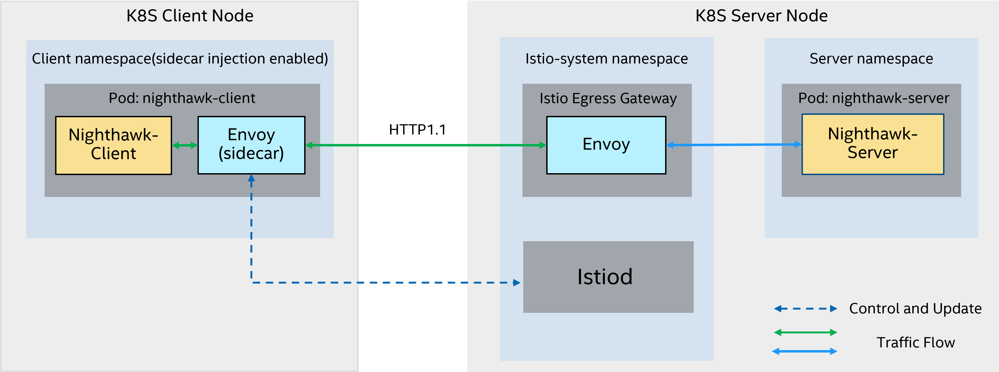

>
> **Note: The Workload Services Framework is a benchmarking framework and is not intended to be used for the deployment of workloads in production environments. It is recommended that users consider any adjustments which may be necessary for the deployment of these workloads in a production environment including those necessary for implementing software best practices for workload scalability and security.**
>
### Introduction

<p align="center"></p>

Istio is an open source service mesh that layers transparently onto existing distributed applications. Istio’s powerful features provide a uniform and more efficient way to secure, connect, and monitor services.

Envoy is a high-performance proxy developed in C++ to mediate all inbound and outbound traffic for all services in the service mesh. Envoy proxies are the only Istio components that interact with data plane traffic.

Istio Forward Proxy is a crucial component within the Istio service mesh architecture that plays a pivotal role in handling outbound traffic from microservices to external destinations. As a type of proxy, it acts as an intermediary between microservices and external services or APIs, facilitating communication while providing additional features for security, observability, and control.

Nighthawk is a L7 performance characterization tool.

This benchmarking is to show Istio Envoy Egress Gateway performance with different payload in K8S microservices environment. In current topology, nighthawk-client is deployed on one node. Istiod, egress-gateway and nighthawk-server is deployed on another node.


### Test Case

The Istio-Envoy workload organizes the following common test cases:

```
Test #1: test_static_Istio-Envoy-Forward_RPS-MAX_http1_2n
Test #2: test_static_Istio-Envoy-Forward_RPS-SLA_http1_2n
Test #3: test_static_Istio-Envoy-Forward_RPS-MAX_http1_2n_pkm
Test #4: test_static_Istio-Envoy-Forward_RPS-MAX_http1_2n_gated
```

- **`MAX-RPS`**: Increases the requested RPS so as to obtain the highest possible achieved RPS without blocking.
- **`RPS-SLA`**: Maximum number of achieved RPS with Latency P99 below RPS-SLA e.g. 50ms..
- **`_pkm`**: This test case will run the whole progress.
- **`_gated`**: Designed for basic function verification.

The workload doesn't support multiple concurrency when executing the test case, which means only one case in the same Kubernetes cluster can be executed at a time.

### Docker Image

This workload provides the following docker images:

- **`server`**: The image contains a simple test server. Concurrency flows load balanced by Istio Ingress Gateway.
- **`client`**: The image is used to collect the following KPIs: RPS (Requests per Second), latency, response body and header size.

The parameters are:

- **`MODE`**: Specify `RPS-MAX` or `RPS-SLA`, default `RPS-MAX`.
- **`PROTOCOL`**: Protocol (currently support HTTP1) in packet generator Nighthawk client, default http1.
- **`SERVER_CORE_NUM`**: The core number used by 1 nighthawk server pod, default 15.
- **`SERVER_MEM`**: The memory size used by 1 nighthawk server pod, default 15Gi.
- **`SERVER_DELAY_MODE`**: Nighthawk server use static or dynamic delay to simulate the real server loading, default dynamic.
- **`SERVER_DELAY_SECONDS`**: When use static delay, the seconds for delay, default 0.5.
- **`SERVER_RESPONSE_BODY_SIZE`**: The payload size of the response body in bytes, default 10.
- **`SERVER_EGRESS_GW_CPU`**: 2, 4, 8, 16 cores for Istio egress gateway, default 8.
- **`SERVER_EGRESS_GW_MEM`**: Memory size 2Gi, 4Gi, 8Gi, 16Gi for Istio egress gateway, default 8Gi.
- **`CLIENT_CORE_NUM`**: the CPU cores for Nighthawk client pod, default 30. The default setting are: CLIENT_CORE_NUM = 8 when SERVER_EGRESS_GW_CPU = 2; CLIENT_CORE_NUM = 16 when SERVER_EGRESS_GW_CPU = 4; CLIENT_CORE_NUM = 30 when SERVER_EGRESS_GW_CPU = 8; CLIENT_CORE_NUM = 40 when SERVER_EGRESS_GW_CPU = 16.
- **`CLIENT_MEM`**: the memory size for Nighthawk client pod, default 30Gi. The default setting are: CLIENT_MEM = 8Gi when SERVER_EGRESS_GW_CPU = 2; CLIENT_CORE_NUM = 16Gi when SERVER_EGRESS_GW_CPU = 4; CLIENT_CORE_NUM = 30Gi when SERVER_EGRESS_GW_CPU = 8; CLIENT_CORE_NUM = 40Gi when SERVER_EGRESS_GW_CPU = 16.
- **`CLIENT_SIDECAR_CPU`**: the CPU cores for Nighthawk client sidecar, default 30. The default setting are: CLIENT_SIDECAR_CPU = 8 when SERVER_EGRESS_GW_CPU = 2; CLIENT_SIDECAR_CPU = 16 when SERVER_EGRESS_GW_CPU = 4; CLIENT_SIDECAR_CPU = 30 when SERVER_EGRESS_GW_CPU = 8; CLIENT_SIDECAR_CPU = 40 when SERVER_EGRESS_GW_CPU = 16.
- **`CLIENT_SIDECAR_MEM`**: the memory size for Nighthawk client psidecarod, default 30Gi. The default setting are: CLIENT_SIDECAR_MEM = 8Gi when SERVER_EGRESS_GW_CPU = 2; CLIENT_SIDECAR_MEM = 16Gi when SERVER_EGRESS_GW_CPU = 4; CLIENT_SIDECAR_MEM = 30Gi when SERVER_EGRESS_GW_CPU = 8; CLIENT_SIDECAR_MEM = 40Gi when SERVER_EGRESS_GW_CPU = 16.
- **`CLIENT_CONNECTIONS`**: The connection number of each worker, default 1000.
- **`CLIENT_CONCURRENCY`**: The worker number of each connection, default auto.
- **`CLIENT_RPS`**: Input request per second for each worker, default 200. Please modify according to the values of SERVER_EGRESS_GW_CPU, CLIENT_REQUEST_BODY_SIZE and SERVER_RESPONSE_BODY_SIZE.
- **`CLIENT_RPS_MAX`**: If the input RPS scan enabled, the max input RPS number to stop the iteration, default 2000. Please modify according to the values of SERVER_EGRESS_GW_CPU, CLIENT_REQUEST_BODY_SIZE and SERVER_RESPONSE_BODY_SIZE.
- **`CLIENT_RPS_STEP`**: Input step number for each iteration to increase, default 200. Please modify according to the values of SERVER_EGRESS_GW_CPU, CLIENT_REQUEST_BODY_SIZE and SERVER_RESPONSE_BODY_SIZE.
- **`CLIENT_LATENCY_BASE`**: The threshold used by RPS-SLA, default 50.
- **`CLIENT_REQUEST_BODY_SIZE`**: The payload size of the request body in bytes, default 400.


The workload should run on a 2-worker kubernetes cluster as follows:

```shell
mkdir -p logs-<REPLACE_YOUR_TESTCASE_HERE>
pod=$(kubectl get pod --selector="job-name-benchmark" -o=jsonpath="{.items[0].metadata.name}")
kubectl exec $pod -- cat output.logs | tar xf - -C <REPLACE_YOUR_TESTCASE_HERE>
```

### KPI

Run the [`kpi.sh`](kpi.sh) script to generate KPIs out of the validation logs.

The following KPI is defined:

- **`*Requests(Per Second)`**: The number requests received per second, which HTTP status code is 2xx.
- **`Latency9`**: The 90 percentile response latency in milliseconds.
- **`Latency99`**: The 99 percentile response latency in milliseconds.
- **`Latency999`**: The 999 percentile response latency in milliseconds.

### System Requirement

#### Kubernetes Configuration

Kubernetes version requirement >= 1.24

* Both client and server nodes need to meet the system requirements.

* In this sample, the NIC used by the cluster is on NUMA node 1, core number is 112.

* CPU Manager Policy: static

* Reserve the CPUs belongs to NUMA 0 for system usage. Use CPU cores on NUMA 1 for benchmark. When run 8C16T case on ICX, 80 CPU cores (40 nh-client cpu cores and 40 sidecar cpu cores) are needed on Client node (default setting). So you need reserve more than 1 socket's cores to benchmarking for ICX having 32 or less cores in 1 socket.

* BM Configuration ARGs of `/var/lib/kubelet/kubeadm-flags.env`:

  ```
  KUBELET_KUBEADM_ARGS="--container-runtime=remote --container-runtime-endpoint=unix:///var/run/containerd/containerd.sock --pod-infra-container-image=k8s.gcr.io/pause:3.7 --reserved-cpus=0-31,64-95 --cpu-manager-policy=static"
  ```
or for running 8C16T case on ICX:
  ```
  KUBELET_KUBEADM_ARGS="--container-runtime=remote --container-runtime-endpoint=unix:///var/run/containerd/containerd.sock --pod-infra-container-image=k8s.gcr.io/pause:3.7 --reserved-cpus=10-31,74-95 --cpu-manager-policy=static"
  ```

### Performance BKM

The Istio-Envoy workload works with the `terraform` validation backend. For simplicity, the workload supports the following limited SUT:

- On-Premesis System

#### Network Configuration

To run this workload for benchmarking and turning, make sure one 100Gb back-to-back connections between device.

#### BIOS Configuration

| Item                             | Setting     |
| -------------------------------- | ----------- |
| Turbo Boost Technology           | Disable     |
| CPU power and performance policy | Performance |
| Hyper Threading                  | Enable      |
| Hardware P-States                | Native Mode |

#### System Configuration

On BM, the operating frequency and uncore frequency should be set to 2.0G for aligning with performance report.

#### Kubernetes Configuration

The configuration method is same as Kubernetes Configuration part in System Requirement section.

### See Also

- [Envoy Official Web Site](https://www.envoyproxy.io/)
- [Istio Official Web Site](https://istio.io)
- [Nighthawk](https://github.com/envoyproxy/nighthawk)
- [Istio Official Performance Guidance](https://istio.io/latest/docs/ops/deployment/performance-and-scalability/)
